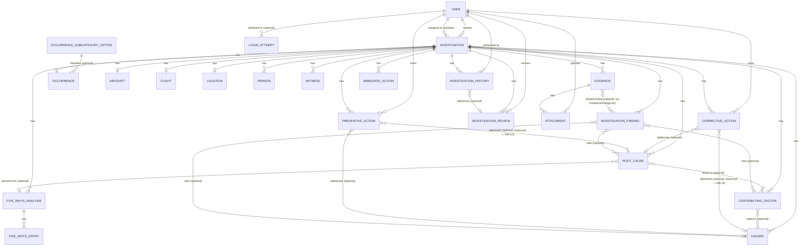

# Data Model — Aviation Incident Investigation Assistant

This revision replaces the previous data model in full: the core entity is renamed `Incident` →
**`Investigation`**, several supporting entities are renamed to match the exact list required for
this pass, `CorrectiveAction` and `PreventiveAction` become separate tables (superseding the earlier
unified `Action` table), and two new entities are introduced: `InvestigationFinding` and
`InvestigationHistory`. This pass also resolves two follow-ups flagged in earlier revisions: the
`status` enum now matches the 6-state model from `investigation-workflow.md`, and
`assignedInvestigatorUserId` is now formally defined. Remaining cross-file follow-ups are listed in
§12.

## 1. Conventions

- **Target RDBMS**: **PostgreSQL** (Neon, per `technical-architecture.md` §5.1), accessed through
  Prisma. This corrects the original SQLite framing (`product-spec.md` A3, superseded — see A1/A2/A3
  in that document's Appendix A): every construct in this document (FKs, composite PKs, `CHECK`
  constraints, unique/composite indexes) was written in portable relational terms specifically so
  this move required no redesign, only a target-database correction (closing spec-review.md SR-020's
  documentation half — the entity/relationship definitions below were already Postgres-compatible).
- **Enumerations**: `technical-architecture.md` §5.2 upgrades these to native Postgres `enum` types
  rather than the `CHECK`-constrained `VARCHAR` this document originally specified for
  SQLite/MySQL portability (DM-5) — a strictly safer mechanism now that portability across those
  other engines is no longer a goal. The *values* fixed below are unchanged; only the storage
  mechanism is upgraded.
- **Timestamps**: `DATETIME` columns are UTC (product-spec A10). `DATE`-only columns have no time
  component.
- **IDs**: `INTEGER PRIMARY KEY AUTOINCREMENT` unless a table uses a natural or composite key
  (noted per entity).
- **Terminology**: "Investigation" (this document and the product-facing UI) and the informal
  "incident" used in early planning conversation refer to the same thing; `Investigation` is now the
  canonical name everywhere, including the primary table.
- **Required vs. optional**: "Required" means `NOT NULL` at the database layer, not merely enforced
  by the UI.

## 2. Entity-Relationship Diagram



*(This diagram was updated to add the three relationship lines above —
`CORRECTIVE_ACTION`↔`HAZARD`, `PREVENTIVE_ACTION`↔`ROOT_CAUSE`, and `EVIDENCE`↔`INVESTIGATION_FINDING`
— which existed in the entity field tables below since the DM-14 and evidence-redesign passes but had
never been added here, per spec-review.md SR-020. `LOGIN_ATTEMPT`'s relationship to `USER` is also
new, added alongside the entity itself — see §3.25.)*

## 3. Entities

### 3.1 User *(supporting entity — not in the required list, but referenced by every attribution
field below)*

| Field | Type | Req. | Description | Validation | Default |
|---|---|---|---|---|---|
| id | INTEGER PK AUTOINCREMENT | Yes | Surrogate key | — | — |
| name | VARCHAR(150) | Yes | Display name | 1–150 chars | — |
| email | VARCHAR(254) | Yes | Login identifier | Unique; valid email format | — |
| passwordHash | VARCHAR(255) | Yes | Bcrypt hash | Never plain text (NFR-4.1) | — |
| role | VARCHAR(30) | Yes | `Administrator`, `InvestigationManager`, `Investigator`, `Reviewer`, `Viewer` | `CHECK` on listed values | — |
| isActive | BOOLEAN | Yes | Deactivation flag, used instead of hard delete | — | `TRUE` |
| createdAt | DATETIME | Yes | Account creation time | — | `CURRENT_TIMESTAMP` |

- **PK**: `id`. **Unique**: `email`. **Indexes**: `email` (unique), `role` (for role-filtered
  pickers, e.g. FR-006's Investigator picker).
- Users are not hard-deletable in this version (no FR defines user deletion — deactivation via
  `isActive` is the only removal path); this is why every FK *to* `User` below defaults to
  `RESTRICT` rather than `CASCADE`.

### 3.2 Investigation *(was `Incident`)*

| Field | Type | Req. | Description | Validation | Default |
|---|---|---|---|---|---|
| id | INTEGER PK AUTOINCREMENT | Yes | Surrogate key | — | — |
| referenceNumber | VARCHAR(20) | Yes | Human-readable case number | Unique; format `INC-YYYY-NNNN`, system-generated | — |
| title | VARCHAR(200) | Yes | Short case title | 1–200 chars | — |
| status | VARCHAR(30) | Yes | Lifecycle stage | `CHECK` IN (`Draft`, `Open`, `UnderInvestigation`, `Analysis`, `Review`, `Closed`) — matches `investigation-workflow.md` §3 | `Draft` |
| reporterName | VARCHAR(150) | Yes | Free-text name of the person who reported the occurrence | 1–150 chars | — |
| createdByUserId | INTEGER FK → User.id | Yes | Who created the record | Must reference an existing User | — |
| assignedInvestigatorUserId | INTEGER FK → User.id | No | The Investigator currently responsible (FR-006) | If set, must reference a User with `role = Investigator` (enforced at application layer — see §11 DM-9) | `NULL` |
| createdAt | DATETIME | Yes | Creation timestamp | — | `CURRENT_TIMESTAMP` |
| updatedAt | DATETIME | Yes | Last modification timestamp | Auto-updated on any change to this row | `CURRENT_TIMESTAMP` |
| closedAt | DATETIME | No | Most recent closure timestamp | Set only when `status = Closed` | `NULL` |
| reopenReason | TEXT | No | Reason given at the most recent reopen | Min 10 chars when set (FR-054) | `NULL` |

- **PK**: `id`. **FKs**: `createdByUserId → User(RESTRICT)`, `assignedInvestigatorUserId →
  User(SET NULL)`. **Indexes**: unique `referenceNumber`; `status`; `assignedInvestigatorUserId`;
  `createdByUserId`.
- **Relationships**: 1:1 with Occurrence, Aircraft, Flight, Location; 1:many with every other
  investigation-scoped entity in this document.
- **Cascade**: deleting an Investigation (only permitted while `status = Draft`, FR-055) cascades to
  every child table listed in §7.
- **Reference number rollover (DM-16, new — closes spec-review.md SR-013)**: `NNNN` is a
  per-calendar-year sequence, not a global one. Implemented as a single-row-per-year counter table
  (`ReferenceNumberSequence(year INTEGER PRIMARY KEY, nextValue INTEGER)`) incremented inside the
  same transaction that creates the `Investigation` row, using an atomic upsert
  (`INSERT ... ON CONFLICT (year) DO UPDATE SET nextValue = nextValue + 1 RETURNING nextValue`) keyed
  on the occurrence's creation year — this is race-safe under concurrent creation both within a year
  and exactly at a year boundary, since the row for the new year is created by the same atomic
  statement the first time it's needed, not by a separate rollover step that could itself race.

### 3.3 Occurrence *(was `OccurrenceDetails`; now also carries the full classification system —
see DM-6, and DM-10 for this revision's redesign of classification specifically)*

**Phase 4 addendum**: this table is created early, in Phase 4, with only `investigationId` and
`occurrenceDateUtc` — FR-005 (Create New Investigation) requires persisting an initial occurrence
date at creation time, before the rest of this table's fields have a form to populate them
(FR-012, Phase 5). Phase 5's migration adds every remaining field below via `ALTER TABLE`, not a
fresh `CREATE TABLE` — `implementation-plan.md`'s original Phase 4/5 database-change split assumed
this whole table was a single Phase 5 addition, which turned out not to account for FR-005's own
field-level dependency on it; corrected here rather than silently building around it.

| Field | Type | Req. | Description | Validation | Default |
|---|---|---|---|---|---|
| investigationId | INTEGER PK/FK → Investigation.id | Yes | Shared 1:1 key | — | — |
| occurrenceDateUtc | DATE | Yes | Date the occurrence happened | Not in the future | — |
| occurrenceTimeUtc | TIME | Yes | Time (UTC) | — | — |
| occurrenceTimeLocal | TIME | No | Local time, display-only | — | `NULL` |
| phaseOfFlight | VARCHAR(30) | Yes | Flight phase at occurrence | `CHECK` IN (`Standing`,`Taxi`,`Takeoff`,`InitialClimb`,`Climb`,`Cruise`,`Descent`,`Approach`,`Landing`,`GoAround`,`PostLandingTaxi`) | — |
| briefDescription | VARCHAR(240) | Yes | Short summary for list views | 1–240 chars | — |
| narrativeDescription | TEXT | Yes | Full narrative | Min 20 chars | — |
| occurrenceCategory | VARCHAR(40) | No | Top-level classification category | `CHECK` IN the 14 values listed in §6.6 | `NULL` |
| occurrenceSubcategoryId | INTEGER FK → OccurrenceSubcategoryOption.id (§3.3.1) | No | Second-level classification, scoped to `occurrenceCategory` | Referenced row's `category` must equal `occurrenceCategory` (app-layer invariant, §3.3.1) | `NULL` |
| actualOutcomeSeverity | VARCHAR(20) | No | What actually happened, rated on the shared outcome scale | `CHECK` IN (`Negligible`,`Minor`,`Major`,`Hazardous`,`Catastrophic`) — reuses `RiskSeverity` (§5) | `NULL` |
| actualOutcomeDescription | TEXT | No | Free-text description of the realized outcome | — | `NULL` |
| potentialOutcomeSeverity | VARCHAR(20) | No | What could plausibly have happened under slightly different circumstances | Same domain as `actualOutcomeSeverity` | `NULL` |
| potentialOutcomeDescription | TEXT | No | Free-text description of the credible worst-case outcome | — | `NULL` |
| likelihoodOfRecurrence | VARCHAR(20) | No | Investigator's assessment of how likely this type of occurrence is to recur | `CHECK` IN (`Rare`,`Unlikely`,`Possible`,`Likely`,`AlmostCertain`) — reuses `RiskLikelihood` (§5) | `NULL` |
| severity | VARCHAR(20) | No | Overall classification severity | Same domain as `actualOutcomeSeverity`; computed by default as the more severe of `actualOutcomeSeverity`/`potentialOutcomeSeverity` (§6.5), directly overridable | `NULL` |
| severityOverridden | BOOLEAN | Yes | Whether `severity` was manually overridden rather than accepting the computed value | — | `FALSE` |
| severityOverrideJustification | TEXT | No | Required when `severityOverridden = TRUE` | Min 20 chars when set | `NULL` |
| riskScore | INTEGER | No | Occurrence-level numeric risk score | Range 1–25; computed as `likelihoodOfRecurrence`(1–5) × `potentialOutcomeSeverity`(1–5) via the shared formula (§6.3) | `NULL` |
| riskBand | VARCHAR(20) | No | Qualitative band for `riskScore` | Must match a currently-active `RiskBandConfiguration.bandLabel` (§6.4) — not a fixed `CHECK` enum, since bands are configurable | `NULL` |
| investigationPriority | VARCHAR(10) | No | Operational triage priority | `CHECK` IN (`Routine`,`Elevated`,`Urgent`,`Immediate`); computed from `severity` × `riskBand` via §6.5's priority matrix, with a category floor for `DangerousGoodsIncident`/`SecurityRelatedOccurrence` | `NULL` |
| priorityOverridden | BOOLEAN | Yes | Whether `investigationPriority` was manually overridden | — | `FALSE` |
| priorityOverrideJustification | TEXT | No | Required when `priorityOverridden = TRUE` | Min 20 chars when set | `NULL` |
| suggestedCategory | VARCHAR(40) | No | Last Investigation Support suggestion (FR-028) — category/subcategory only; severity/risk/priority are computed, not narrative-suggested (§6.5) | Same domain as `occurrenceCategory` | `NULL` |
| suggestedSubcategoryId | INTEGER FK → OccurrenceSubcategoryOption.id | No | Last Investigation Support suggestion, paired with `suggestedCategory` | — | `NULL` |
| wasSuggestionAccepted | BOOLEAN | No | Whether the last category/subcategory suggestion was accepted as-is | — | `NULL` |
| classifiedByUserId | INTEGER FK → User.id | No | Who set the classification | Must reference an existing User | `NULL` |
| classifiedAt | DATETIME | No | When classified | — | `NULL` |
| noPersonsInvolvedConfirmed | BOOLEAN | Yes | Explicit "no persons involved" acknowledgment (FR-016) | — | `FALSE` |
| noWitnessesConfirmed | BOOLEAN | Yes | Explicit "no witnesses" acknowledgment (workflow §9.3) | — | `FALSE` |
| noEvidenceAvailableConfirmed | BOOLEAN | Yes | Explicit "no evidence available" acknowledgment (workflow §9.2) | — | `FALSE` |

- **PK**: `investigationId` (also the FK — 1:1 sharing the parent's key). **FKs**:
  `investigationId → Investigation(CASCADE)`, `classifiedByUserId → User(RESTRICT)`,
  `occurrenceSubcategoryId → OccurrenceSubcategoryOption(RESTRICT)`, `suggestedSubcategoryId →
  OccurrenceSubcategoryOption(SET NULL)`.
- **DM-6 design note**: classification is stored on `Occurrence` rather than a separate
  `Classification` table, since the two were always 1:1 with the investigation and the requested
  minimum entity list does not include a standalone `Classification` entity. This supersedes prior
  drafts that referenced `Classification.wasSuggestionAccepted` directly — see §12.
- **DM-10 design note (this revision)**: `actualOutcomeSeverity` and `potentialOutcomeSeverity` are
  deliberately separate fields — see §6.6 for the full taxonomy, the actual-vs-potential distinction,
  and the required regulator-neutrality disclaimer.

### 3.3.1 OccurrenceSubcategoryOption *(supporting reference/lookup table — new in this revision)*

A controlled-vocabulary lookup table seeded at deployment time with every valid (category,
subcategory) pair from §6.6. Not user-editable through any FR in this version — subcategories are
fixed, curated content, consistent with how the fixed 5×5 risk matrix (§6) is also not
user-configurable.

| Field | Type | Req. | Description | Validation | Default |
|---|---|---|---|---|---|
| id | INTEGER PK AUTOINCREMENT | Yes | Surrogate key | — | — |
| category | VARCHAR(40) | Yes | The parent category this subcategory belongs to | `CHECK` IN the 14 values in §6.6 | — |
| subcategory | VARCHAR(80) | Yes | The subcategory label | 1–80 chars | — |
| displayOrder | INTEGER | Yes | Sort order within its category | — | `0` |
| isActive | BOOLEAN | Yes | Soft-disable flag (a subcategory is deactivated, never hard-deleted, once in use — mirrors the `User.isActive` pattern) | — | `TRUE` |

- **PK**: `id`. **Unique**: (`category`, `subcategory`). **Index**: `category` (for populating the
  category-scoped subcategory picker, FR-027).
- **Invariant** (application-layer): `Occurrence.occurrenceSubcategoryId`'s referenced row's
  `category` must equal `Occurrence.occurrenceCategory` — not expressible as a plain FK constraint
  since it spans two columns across tables; enforced the same way as the comparable invariant on
  `Investigation.assignedInvestigatorUserId` (DM-9).

### 3.4 Aircraft

| Field | Type | Req. | Description | Validation | Default |
|---|---|---|---|---|---|
| investigationId | INTEGER PK/FK → Investigation.id | Yes | Shared 1:1 key | — | — |
| registration | VARCHAR(20) | Yes | Fictional tail number, e.g. `G-FICT2` | 1–20 chars | — |
| manufacturer | VARCHAR(100) | Yes | Fictional manufacturer | 1–100 chars | — |
| model | VARCHAR(100) | Yes | Fictional aircraft model | 1–100 chars | — |
| serialNumber | VARCHAR(50) | No | Manufacturer serial number | — | `NULL` |
| yearOfManufacture | INTEGER | No | 4-digit year | ≤ current year | `NULL` |
| operatorName | VARCHAR(150) | Yes | Fictional operator/airline | 1–150 chars | — |
| engineType | VARCHAR(100) | No | Engine model/type | — | `NULL` |
| engineCount | INTEGER | Yes | Number of engines | > 0 | `1` |
| damageLevel | VARCHAR(20) | Yes | Damage sustained | `CHECK` IN (`None`,`Minor`,`Substantial`,`Destroyed`) | `None` |

- **PK**: `investigationId`. **FK**: `investigationId → Investigation(CASCADE)`.
- **DM-1 (carried forward)**: one Aircraft row per Investigation in this version — see §11.

### 3.5 Flight *(was `FlightInformation`)*

| Field | Type | Req. | Description | Validation | Default |
|---|---|---|---|---|---|
| investigationId | INTEGER PK/FK → Investigation.id | Yes | Shared 1:1 key | — | — |
| flightNumber | VARCHAR(20) | No | Flight number/call sign | — | `NULL` |
| flightRules | VARCHAR(10) | Yes | Flight rules | `CHECK` IN (`VFR`,`IFR`) | — |
| departureAerodrome | VARCHAR(100) | Yes | Departure aerodrome (fictional code/name) | 1–100 chars | — |
| destinationAerodrome | VARCHAR(100) | Yes | Destination aerodrome | 1–100 chars | — |
| alternateAerodrome | VARCHAR(100) | No | Alternate aerodrome | — | `NULL` |
| picName | VARCHAR(150) | Yes | Pilot-in-command name (fictional) | 1–150 chars | — |
| picLicenseNumber | VARCHAR(50) | No | Fictional license number | — | `NULL` |
| crewComplement | INTEGER | Yes | Total crew count | > 0 | `1` |

- **PK**: `investigationId`. **FK**: `investigationId → Investigation(CASCADE)`.

### 3.6 Location *(was `LocationConditions`)*

| Field | Type | Req. | Description | Validation | Default |
|---|---|---|---|---|---|
| investigationId | INTEGER PK/FK → Investigation.id | Yes | Shared 1:1 key | — | — |
| locationDescription | TEXT | Yes | Free-text location | 1+ chars | — |
| latitude | DECIMAL(9,6) | No | Latitude | −90 ≤ x ≤ 90 | `NULL` |
| longitude | DECIMAL(9,6) | No | Longitude | −180 ≤ x ≤ 180 | `NULL` |
| aerodromeCode | VARCHAR(10) | No | ICAO/IATA-style fictional code | — | `NULL` |
| weatherVisibility | VARCHAR(50) | No | Visibility conditions | — | `NULL` |
| windSpeedKt | INTEGER | No | Wind speed, knots | ≥ 0 | `NULL` |
| windDirectionDeg | INTEGER | No | Wind direction | 0–360 | `NULL` |
| cloudCover | VARCHAR(50) | No | Cloud cover description | — | `NULL` |
| temperatureC | INTEGER | No | Temperature, °C | — | `NULL` |
| precipitation | VARCHAR(50) | No | Precipitation description | — | `NULL` |
| runwayInUse | VARCHAR(20) | No | Runway designator | — | `NULL` |
| lightingConditions | VARCHAR(10) | Yes | Lighting at occurrence | `CHECK` IN (`Day`,`Night`,`Dusk`,`Dawn`) | — |
| terrainType | VARCHAR(50) | No | Terrain description | — | `NULL` |

- **PK**: `investigationId`. **FK**: `investigationId → Investigation(CASCADE)`.

### 3.7 Person *(was `PersonInvolved`)*

| Field | Type | Req. | Description | Validation | Default |
|---|---|---|---|---|---|
| id | INTEGER PK AUTOINCREMENT | Yes | Surrogate key | — | — |
| investigationId | INTEGER FK → Investigation.id | Yes | Parent investigation | — | — |
| name | VARCHAR(150) | Yes | Fictional person name | 1–150 chars | — |
| roleType | VARCHAR(20) | Yes | Role at time of occurrence | `CHECK` IN (`PIC`,`FirstOfficer`,`CabinCrew`,`ATC`,`GroundStaff`,`Maintenance`,`Passenger`,`Other`) | — |
| licenseNumber | VARCHAR(50) | No | Fictional license number | — | `NULL` |
| nationality | VARCHAR(60) | No | Fictional nationality | — | `NULL` |
| injuryLevel | VARCHAR(10) | Yes | Injury outcome | `CHECK` IN (`None`,`Minor`,`Serious`,`Fatal`) | `None` |
| notes | TEXT | No | Free-text notes | — | `NULL` |

- **PK**: `id`. **FK**: `investigationId → Investigation(CASCADE)`. **Index**: `investigationId`.

### 3.8 Witness

| Field | Type | Req. | Description | Validation | Default |
|---|---|---|---|---|---|
| id | INTEGER PK AUTOINCREMENT | Yes | Surrogate key | — | — |
| investigationId | INTEGER FK → Investigation.id | Yes | Parent investigation | — | — |
| name | VARCHAR(150) | Yes | Witness name; literal `"Unknown / Unidentified"` is a valid value (workflow §9.3) | 1–150 chars | — |
| contactInfo | VARCHAR(200) | No | Contact details | — | `NULL` |
| witnessType | VARCHAR(20) | Yes | Category of witness | `CHECK` IN (`Crew`,`Passenger`,`ATC`,`GroundObserver`,`Other`) | — |
| statementSummary | TEXT | Yes | Summary of statement | Min 10 chars | — |
| statementDate | DATE | No | Date statement given | — | `NULL` |
| reliabilityAssessment | VARCHAR(10) | Yes | Investigator's assessment | `CHECK` IN (`High`,`Medium`,`Low`) | — |
| reliabilityNotes | TEXT | No | Justification | — | `NULL` |

- **PK**: `id`. **FK**: `investigationId → Investigation(CASCADE)`. **Index**: `investigationId`.

### 3.9 Evidence *(field set and taxonomy redesigned this revision — see DM-15, §6.10–§6.11)*

| Field | Type | Req. | Description | Validation | Default |
|---|---|---|---|---|---|
| id | INTEGER PK AUTOINCREMENT | Yes | Evidence ID — surrogate key | — | — |
| investigationId | INTEGER FK → Investigation.id | Yes | Parent investigation | — | — |
| evidenceType | VARCHAR(30) | Yes | Category of evidence | `CHECK` IN (`Photographs`,`Documents`,`Statements`,`CCTVReference`,`FlightRecords`,`MaintenanceRecords`,`GroundHandlingRecords`,`TrainingRecords`,`Emails`,`Other`) — see §6.10 | — |
| description | TEXT | Yes | Description | 1+ chars | — |
| source | VARCHAR(200) | Yes | Where/whom the evidence originated from (e.g. "ZZFC Tower ATC," "Aeroventure MRO records department") — distinct from `collectedBy`, which is who on the investigation logged it | 1–200 chars | — |
| collectedBy | VARCHAR(150) | No | Who on the investigation collected/logged it | — | `NULL` |
| dateObtained | DATE | No | When obtained (renamed from `collectedDate` this revision) | Not in the future | `NULL` |
| relevance | VARCHAR(10) | Yes | How relevant this item is to the investigation | `CHECK` IN (`High`,`Medium`,`Low`) | — |
| reliabilityAssessment | VARCHAR(10) | Yes | Investigator's assessment of how reliable the evidence/source is | `CHECK` IN (`High`,`Medium`,`Low`) — same scale as `Witness.reliabilityAssessment` (§3.8) | — |
| reliabilityNotes | TEXT | No | Justification for the reliability assessment | — | `NULL` |
| investigatorNotes | TEXT | No | Free-text investigator commentary, separate from the reliability justification | — | `NULL` |
| custodyNotes | TEXT | No | Chain-of-custody notes | — | `NULL` |

- **PK**: `id`. **FK**: `investigationId → Investigation(CASCADE)`. **Indexes**: `investigationId`;
  `evidenceType`; `relevance`.
- **"Related finding"** is modeled as a many-to-many link to `InvestigationFinding` via
  `EvidenceFindingLink` (§3.22), not a direct FK — one evidence item may support several findings,
  and one finding is typically supported by several evidence items (e.g. a flight-data record and a
  maintenance log both citing the same finding).
- **CCTV Reference design note**: `CCTVReference` evidence records a *pointer* to footage retained
  elsewhere (camera ID, timestamp window, custodian — captured in `description`/`source`), not an
  uploaded video file. Video is deliberately not an accepted attachment type at all (§6.10) — see
  §6.11 for the security rationale.

### 3.10 Attachment *(supporting entity, child of Evidence; storage abstracted this revision — see
§6.10)*

| Field | Type | Req. | Description | Validation | Default |
|---|---|---|---|---|---|
| id | INTEGER PK AUTOINCREMENT | Yes | Surrogate key | — | — |
| evidenceId | INTEGER FK → Evidence.id | Yes | Parent evidence item | — | — |
| fileName | VARCHAR(255) | Yes | Original file name | Sanitized server-side before storage | — |
| mimeType | VARCHAR(100) | Yes | Detected MIME type | `CHECK` IN (`image/jpeg`,`image/png`,`application/pdf`,`text/plain`) — deliberately excludes video/audio/executable/office-macro formats, see §6.11 | — |
| fileSizeBytes | INTEGER | Yes | File size | ≤ 10,485,760 (10MB, NFR-4.5) | — |
| storagePath | VARCHAR(500) | Yes | Opaque handle resolved by the active `StorageProvider` (§6.10) — a local relative path today, potentially an object-store key later | Unique | — |
| isSimulated | BOOLEAN | Yes | `TRUE` for seed/demo placeholder attachments with no real retrievable file content behind them; `FALSE` for genuinely uploaded files (§6.10) | — | `FALSE` |
| uploadedByUserId | INTEGER FK → User.id | Yes | Uploader | — | — |
| uploadedAt | DATETIME | Yes | Upload timestamp | — | `CURRENT_TIMESTAMP` |

- **PK**: `id`. **FKs**: `evidenceId → Evidence(CASCADE)`, `uploadedByUserId → User(RESTRICT)`.
  **Indexes**: `evidenceId`; unique `storagePath`.
- A simulated attachment's `storagePath` resolves to one shared, bundled placeholder file (§6.10),
  never to real content — `isSimulated` exists specifically so the UI/report can label it
  transparently ("Simulated attachment — placeholder for demonstration") rather than presenting a
  fictional seed-data attachment as if it were genuine evidentiary content.

### 3.11 ImmediateAction

| Field | Type | Req. | Description | Validation | Default |
|---|---|---|---|---|---|
| id | INTEGER PK AUTOINCREMENT | Yes | Surrogate key | — | — |
| investigationId | INTEGER FK → Investigation.id | Yes | Parent investigation | — | — |
| description | TEXT | Yes | What was done | 1+ chars | — |
| takenBy | VARCHAR(150) | Yes | Who took the action | 1–150 chars | — |
| occurredAt | DATETIME | Yes | When taken | Must be ≥ `Occurrence.occurrenceDateUtc`/`Time` (app-layer check) | — |
| actionType | VARCHAR(20) | Yes | Category | `CHECK` IN (`Safety`,`Operational`,`Notification`) | — |

- **PK**: `id`. **FK**: `investigationId → Investigation(CASCADE)`. **Index**: `investigationId`.

### 3.12 Hazard *(risk fields redesigned this revision — see DM-12 and §6)*

| Field | Type | Req. | Description | Validation | Default |
|---|---|---|---|---|---|
| id | INTEGER PK AUTOINCREMENT | Yes | Surrogate key | — | — |
| investigationId | INTEGER FK → Investigation.id | Yes | Parent investigation | — | — |
| description | TEXT | Yes | Hazard description | 1+ chars | — |
| hazardCategory | VARCHAR(20) | Yes | Category | `CHECK` IN (`HumanFactors`,`Technical`,`Environmental`,`Organizational`,`Other`) | — |
| initialLikelihood | VARCHAR(20) | Yes | Likelihood **before** existing controls are considered | `CHECK` IN (`Rare`,`Unlikely`,`Possible`,`Likely`,`AlmostCertain`) — numeric weights 1–5 per §6 | — |
| initialSeverity | VARCHAR(20) | Yes | Severity **before** existing controls are considered | `CHECK` IN (`Negligible`,`Minor`,`Moderate`,`Major`,`Catastrophic`) — numeric weights 1–5 per §6 | — |
| initialRiskScore | INTEGER | Yes | Computed: `initialLikelihood`(1–5) × `initialSeverity`(1–5) | Range 1–25; computed by application logic, stored (not virtual) so historical reports stay stable if risk bands are later reconfigured | — |
| initialRiskBand | VARCHAR(20) | Yes | Computed band label for `initialRiskScore` | Must match a currently-active `RiskBandConfiguration` row's `bandLabel` at the time of computation (not a fixed `CHECK` enum — see §6, this value is genuinely configurable) | — |
| existingControls | TEXT | No | Description of mitigations already in place at the time of assessment | — | `NULL` |
| residualLikelihood | VARCHAR(20) | No | Likelihood **after** existing controls are factored in | Same domain as `initialLikelihood` | `NULL` |
| residualSeverity | VARCHAR(20) | No | Severity **after** existing controls are factored in | Same domain as `initialSeverity` | `NULL` |
| residualRiskScore | INTEGER | No | Computed: `residualLikelihood` × `residualSeverity` | Range 1–25 when set; if greater than `initialRiskScore`, saved but flagged with a non-blocking inline warning (FR-029 — controls unexpectedly increasing assessed risk is unusual but not impossible, e.g. a control later found ineffective) | `NULL` |
| residualRiskBand | VARCHAR(20) | No | Computed band label for `residualRiskScore` | Same rule as `initialRiskBand` | `NULL` |

- **PK**: `id`. **FK**: `investigationId → Investigation(CASCADE)`. **Indexes**: `investigationId`;
  `initialRiskBand`; `residualRiskBand` (portfolio-level "high-risk" queries, e.g. the dashboard's
  High-Risk Findings tile, use `residualRiskBand` — see `functional-requirements.md` §1.0.2's
  updated definition).
- **Design note**: Initial Risk (`initialLikelihood`/`initialSeverity`/`initialRiskScore`
  /`initialRiskBand`) is required — every hazard must be scored before any controls are considered.
  Residual Risk is optional at creation (an investigator may not yet have assessed existing controls)
  but is required before the Analysis → Review completeness gate is satisfied for that hazard's
  investigation (`investigation-workflow.md` §8) — recording a residual assessment for every
  identified hazard is what distinguishes a completed risk assessment from an initial triage note.

### 3.13 ContributingFactor *(category taxonomy expanded this revision — see DM-13, §6.7)*

| Field | Type | Req. | Description | Validation | Default |
|---|---|---|---|---|---|
| id | INTEGER PK AUTOINCREMENT | Yes | Surrogate key | — | — |
| investigationId | INTEGER FK → Investigation.id | Yes | Parent investigation | — | — |
| description | TEXT | Yes | Factor description | 1+ chars | — |
| category | VARCHAR(20) | Yes | Category | `CHECK` IN the 10 `FactorCategory` values in §6.7 | — |

- **PK**: `id`. **FK**: `investigationId → Investigation(CASCADE)`. **Index**: `investigationId`.

### 3.14 ContributingFactorHazardLink *(supporting join table — many-to-many)*

| Field | Type | Req. | Description |
|---|---|---|---|
| contributingFactorId | INTEGER FK → ContributingFactor.id | Yes | Half of composite PK |
| hazardId | INTEGER FK → Hazard.id | Yes | Half of composite PK |

- **PK**: composite (`contributingFactorId`, `hazardId`). **FKs**: both `CASCADE`.
- **Invariant** (application-layer, not directly expressible as a plain FK constraint): both rows
  must belong to the same `investigationId`.

### 3.15 FiveWhysAnalysis

| Field | Type | Req. | Description | Validation | Default |
|---|---|---|---|---|---|
| id | INTEGER PK AUTOINCREMENT | Yes | Surrogate key | — | — |
| investigationId | INTEGER FK → Investigation.id | Yes | Parent investigation | — | — |
| problemStatement | TEXT | Yes | Starting problem statement | Min 10 chars | — |
| createdByUserId | INTEGER FK → User.id | Yes | Author | — | — |
| createdAt | DATETIME | Yes | Creation timestamp | — | `CURRENT_TIMESTAMP` |

- **PK**: `id`. **FKs**: `investigationId → Investigation(CASCADE)`, `createdByUserId →
  User(RESTRICT)`. **Index**: `investigationId`.

### 3.16 FiveWhysEntry *(supporting entity, child of FiveWhysAnalysis; capped at 5 this revision)*

| Field | Type | Req. | Description | Validation | Default |
|---|---|---|---|---|---|
| id | INTEGER PK AUTOINCREMENT | Yes | Surrogate key | — | — |
| fiveWhysAnalysisId | INTEGER FK → FiveWhysAnalysis.id | Yes | Parent analysis | — | — |
| sequenceNumber | INTEGER | Yes | Order within the analysis, corresponding to "Why #1"…"Why #5" | 1–5 (reduced from the prior 1–10 cap — see DM-13); unique within `fiveWhysAnalysisId` | — |
| question | TEXT | Yes | The "why" question | 1+ chars | — |
| answer | TEXT | Yes | The answer | 1+ chars | — |

- **PK**: `id`. **FK**: `fiveWhysAnalysisId → FiveWhysAnalysis(CASCADE)`. **Indexes**:
  `fiveWhysAnalysisId`; unique composite (`fiveWhysAnalysisId`, `sequenceNumber`).
- **Design note**: an investigator may stop after any entry from Why #1 onward once a root cause is
  considered established (FR-034/FR-035) — there is no requirement to reach Why #5. The cap exists
  only to bound the chain length, not to mandate reaching it.

### 3.17 RootCause *(enriched this revision with Supporting Evidence, Investigator Notes, and
Confidence Level — see DM-13, §6.8, and product-spec §11.6)*

| Field | Type | Req. | Description | Validation | Default |
|---|---|---|---|---|---|
| id | INTEGER PK AUTOINCREMENT | Yes | Surrogate key | — | — |
| investigationId | INTEGER FK → Investigation.id | Yes | Parent investigation | — | — |
| description | TEXT | Yes | The potential root cause statement (labeled "Potential Root Cause" in the UI/report, never "Root Cause" or "Confirmed Cause" — product-spec §11.6) | Required unless `isInconclusive = TRUE` | — |
| category | VARCHAR(20) | Yes | Category | `CHECK` IN the 10 `FactorCategory` values in §6.7 | — |
| fiveWhysAnalysisId | INTEGER FK → FiveWhysAnalysis.id | No | The 5 Whys chain this conclusion is drawn from, if any | Unique when set — at most one `RootCause` may conclude a given `FiveWhysAnalysis` (§6.8) | `NULL` |
| supportingEvidence | TEXT | Yes | What evidence (or acknowledged absence of evidence) supports this assessment | Required unless `isInconclusive = TRUE`; min 10 chars — an explicit "no direct supporting evidence identified yet" is an acceptable value, but the field cannot be left blank (product-spec §11.6) | — |
| investigatorNotes | TEXT | No | Free-text caveats, alternative theories considered, or context for the assessment | — | `NULL` |
| confidenceLevel | VARCHAR(10) | Yes | The investigator's stated confidence in this assessment | `CHECK` IN (`Low`,`Medium`,`High`); required unless `isInconclusive = TRUE` | — |
| isInconclusive | BOOLEAN | Yes | Set when using the "root cause could not be conclusively identified" override (workflow §9.5) | — | `FALSE` |
| inconclusiveJustification | TEXT | No | Required when `isInconclusive = TRUE` | Min 20 chars when set | `NULL` |

- **PK**: `id`. **FKs**: `investigationId → Investigation(CASCADE)`, `fiveWhysAnalysisId →
  FiveWhysAnalysis(SET NULL)`. **Indexes**: `investigationId`; unique(`fiveWhysAnalysisId`) where not
  null.
- **Design note**: `description`, `supportingEvidence`, and `confidenceLevel` are required together
  as a set — a root cause is never recorded as a bare, unqualified statement; it must always carry
  its evidentiary basis and the investigator's own confidence in it (or use the inconclusive
  override instead of asserting any of the three). This is the mechanism behind product-spec §11.6's
  "never automatically declare a root cause as fact" rule.

### 3.18 RootCauseContributingFactorLink *(supporting join table — many-to-many)*

| Field | Type | Req. | Description |
|---|---|---|---|
| rootCauseId | INTEGER FK → RootCause.id | Yes | Half of composite PK |
| contributingFactorId | INTEGER FK → ContributingFactor.id | Yes | Half of composite PK |

- **PK**: composite (`rootCauseId`, `contributingFactorId`). **FKs**: both `CASCADE`.

### 3.19 CorrectiveAction *(separate table — see DM-2 supersession in §11; field set expanded this
revision — see DM-14, §6.9)*

| Field | Type | Req. | Description | Validation | Default |
|---|---|---|---|---|---|
| id | INTEGER PK AUTOINCREMENT | Yes | Action ID — surrogate key | — | — |
| investigationId | INTEGER FK → Investigation.id | Yes | Parent investigation | — | — |
| description | TEXT | Yes | Action description | 1+ chars | — |
| priority | VARCHAR(10) | Yes | Priority | `CHECK` IN (`Low`,`Medium`,`High`,`Critical`) | — |
| status | VARCHAR(15) | Yes | Lifecycle status | `CHECK` IN (`Open`,`Assigned`,`InProgress`,`Completed`,`Verified`,`Cancelled`) — 6 stored values; `Overdue` is derived/display-only (FR-046), never stored — see §6.9 | `Open` |
| targetDate | DATE | Yes | Target completion date (renamed from `dueDate` this revision) | ≥ creation date when first created (app-layer; may be edited to a past date later, FR-040 edge case) | — |
| completedDate | DATE | No | Completion date | ≤ today; required when `status IN (Completed, Verified)` | `NULL` |
| verificationMethod | VARCHAR(30) | No | How effectiveness was verified | `CHECK` IN (`FollowUpInspection`,`DataReview`,`Audit`,`Retest`,`StakeholderInterview`,`Other`); required when `status = Verified` | `NULL` |
| verificationNotes | TEXT | No | Free-text elaboration on the verification | — | `NULL` |
| effectivenessResult | VARCHAR(20) | No | Outcome of the verification | `CHECK` IN (`Effective`,`PartiallyEffective`,`NotEffective`,`TooEarlyToAssess`); required when `status = Verified` | `NULL` |
| investigatorComments | TEXT | No | General investigator commentary on this action, separate from verification detail | — | `NULL` |
| ownerUserId | INTEGER FK → User.id | No | Responsible person — registered-user owner | Exactly one of `ownerUserId`/`ownerExternalName` set | `NULL` |
| ownerExternalName | VARCHAR(150) | No | Responsible person — external owner name | Exactly one of the two set (`CHECK`) | `NULL` |
| department | VARCHAR(100) | No | Responsible department (free text — no `Department` entity exists in this version, DM-14) | — | `NULL` |
| rootCauseId | INTEGER FK → RootCause.id | No | Root cause this addresses | — | `NULL` |
| hazardId | INTEGER FK → Hazard.id | No | Hazard this addresses *(new this revision — both action types may now optionally reference either)* | — | `NULL` |
| requiredForClosure | BOOLEAN | Yes | Whether this action must reach a resolved status before the investigation can close (§6.9) | — | `TRUE` |

- **PK**: `id`. **FKs**: `investigationId → Investigation(CASCADE)`, `ownerUserId →
  User(RESTRICT)`, `rootCauseId → RootCause(SET NULL)`, `hazardId → Hazard(SET NULL)`. **Indexes**:
  `investigationId`; `status`; `targetDate` (supports Overdue computation, FR-046); `ownerUserId`;
  (`requiredForClosure`, `status`) — supports the closure-gate query in §6.9.
- **CHECK**: `(ownerUserId IS NOT NULL) <> (ownerExternalName IS NOT NULL)`.
- **Default rationale for `requiredForClosure`**: defaults `TRUE` for `CorrectiveAction`, since
  corrective actions typically address this specific occurrence's immediate causes and are
  reasonably expected to be resolved before the investigation report is finalized.

### 3.20 PreventiveAction *(separate table, mirrors CorrectiveAction — see DM-2; field set expanded
this revision — see DM-14, §6.9)*

| Field | Type | Req. | Description | Validation | Default |
|---|---|---|---|---|---|
| id | INTEGER PK AUTOINCREMENT | Yes | Action ID — surrogate key | — | — |
| investigationId | INTEGER FK → Investigation.id | Yes | Parent investigation | — | — |
| description | TEXT | Yes | Action description | 1+ chars | — |
| priority | VARCHAR(10) | Yes | Priority | `CHECK` IN (`Low`,`Medium`,`High`,`Critical`) | — |
| status | VARCHAR(15) | Yes | Lifecycle status | Same domain as `CorrectiveAction.status` | `Open` |
| targetDate | DATE | Yes | Target completion date | Same rule as `CorrectiveAction.targetDate` | — |
| completedDate | DATE | No | Completion date | Same rule as `CorrectiveAction.completedDate` | `NULL` |
| verificationMethod | VARCHAR(30) | No | How effectiveness was verified | Same domain and rule as `CorrectiveAction.verificationMethod` | `NULL` |
| verificationNotes | TEXT | No | Free-text elaboration on the verification | — | `NULL` |
| effectivenessResult | VARCHAR(20) | No | Outcome of the verification | Same domain and rule as `CorrectiveAction.effectivenessResult` | `NULL` |
| investigatorComments | TEXT | No | General investigator commentary | — | `NULL` |
| ownerUserId | INTEGER FK → User.id | No | Responsible person — registered-user owner | Exactly one of the pair set | `NULL` |
| ownerExternalName | VARCHAR(150) | No | Responsible person — external owner name | Exactly one of the pair set (`CHECK`) | `NULL` |
| department | VARCHAR(100) | No | Responsible department (free text) | — | `NULL` |
| hazardId | INTEGER FK → Hazard.id | No | Hazard this addresses | — | `NULL` |
| rootCauseId | INTEGER FK → RootCause.id | No | Root cause this addresses *(new this revision)* | — | `NULL` |
| requiredForClosure | BOOLEAN | Yes | Whether this action must reach a resolved status before the investigation can close (§6.9) | — | `FALSE` |

- **PK**: `id`. **FKs**: `investigationId → Investigation(CASCADE)`, `ownerUserId →
  User(RESTRICT)`, `hazardId → Hazard(SET NULL)`, `rootCauseId → RootCause(SET NULL)`. **Indexes**:
  same pattern as `CorrectiveAction`.
- **CHECK**: `(ownerUserId IS NOT NULL) <> (ownerExternalName IS NOT NULL)`.
- **Default rationale for `requiredForClosure`**: defaults `FALSE` for `PreventiveAction`, since
  preventive measures often involve longer-term, system-level changes (e.g. a fleet-wide training
  rollout) that realistically extend beyond a single investigation's closure — an investigator may
  still flag a specific preventive action `TRUE` when it genuinely must land before closure.

### 3.21 InvestigationFinding *(new entity)*

A **Finding** is a formal, investigator-authored, numbered statement synthesizing the
investigation's conclusions for the final report — distinct from the granular `Hazard` /
`ContributingFactor` / `RootCause` analytical records, which are the working material a Finding may
draw on. This mirrors the "Findings" section of a real accident-investigation report (a discrete,
human-written list of statements), and is not the same thing as an Investigation Support suggestion
— a Finding is always fully authored and confirmed by a human investigator, never system-generated
(product-spec §11.1's banned-wording rule concerns *system-generated* content, not this entity).

| Field | Type | Req. | Description | Validation | Default |
|---|---|---|---|---|---|
| id | INTEGER PK AUTOINCREMENT | Yes | Surrogate key | — | — |
| investigationId | INTEGER FK → Investigation.id | Yes | Parent investigation | — | — |
| findingNumber | INTEGER | Yes | Sequential number within the investigation | Unique within `investigationId`, starts at 1 | — |
| findingType | VARCHAR(20) | Yes | Nature of the finding | `CHECK` IN (`Cause`,`ContributingFactor`,`RiskObservation`,`Other`) | — |
| description | TEXT | Yes | The finding statement | Min 20 chars | — |
| createdByUserId | INTEGER FK → User.id | Yes | Author | — | — |
| createdAt | DATETIME | Yes | Creation timestamp | — | `CURRENT_TIMESTAMP` |

- **PK**: `id`. **FKs**: `investigationId → Investigation(CASCADE)`, `createdByUserId →
  User(RESTRICT)`. **Indexes**: `investigationId`; unique composite (`investigationId`,
  `findingNumber`).

### 3.22 Finding Link Tables *(supporting join tables — many-to-many, optional citations)*

Four separate junction tables (rather than one polymorphic table) so each retains a real,
DB-enforced foreign key — a polymorphic "linkedEntityType/linkedEntityId" design would not allow the
database itself to guarantee referential integrity, which matters for "suitable for a real
relational database."

| Table | Columns | PK |
|---|---|---|
| FindingHazardLink | `findingId` FK → InvestigationFinding.id (CASCADE), `hazardId` FK → Hazard.id (CASCADE) | composite (`findingId`, `hazardId`) |
| FindingContributingFactorLink | `findingId` FK → InvestigationFinding.id (CASCADE), `contributingFactorId` FK → ContributingFactor.id (CASCADE) | composite (`findingId`, `contributingFactorId`) |
| FindingRootCauseLink | `findingId` FK → InvestigationFinding.id (CASCADE), `rootCauseId` FK → RootCause.id (CASCADE) | composite (`findingId`, `rootCauseId`) |
| EvidenceFindingLink *(new this revision)* | `evidenceId` FK → Evidence.id (CASCADE), `findingId` FK → InvestigationFinding.id (CASCADE) | composite (`evidenceId`, `findingId`) |

### 3.23 InvestigationReview *(was `ReviewLog`)*

| Field | Type | Req. | Description | Validation | Default |
|---|---|---|---|---|---|
| id | INTEGER PK AUTOINCREMENT | Yes | Surrogate key | — | — |
| investigationId | INTEGER FK → Investigation.id | Yes | Parent investigation | — | — |
| reviewerUserId | INTEGER FK → User.id | Yes | Deciding reviewer | Must reference a User with `role = Reviewer` (or `Administrator` using the emergency override, `investigation-workflow.md` §10) — enforced at application layer | — |
| reviewDecision | VARCHAR(20) | Yes | Decision | `CHECK` IN (`Approved`,`ChangesRequested`) | — |
| comments | TEXT | No | Reviewer comments | Required, min 10 chars, when `reviewDecision = ChangesRequested` (app-layer conditional rule, FR-052); optional otherwise | `NULL` |
| decidedAt | DATETIME | Yes | Decision timestamp | — | `CURRENT_TIMESTAMP` |

- **PK**: `id`. **FKs**: `investigationId → Investigation(CASCADE)`, `reviewerUserId →
  User(RESTRICT)`. **Index**: `investigationId`.
- This table is the durable **decision record**; every row here is also mirrored as a summary event
  in `InvestigationHistory` (§3.24) so the two audit views (decision detail vs. full timeline)
  stay consistent by construction — `InvestigationHistory.relatedReviewId` points back to the row
  here.

### 3.24 InvestigationHistory *(new entity — append-only audit log)*

| Field | Type | Req. | Description | Validation | Default |
|---|---|---|---|---|---|
| id | INTEGER PK AUTOINCREMENT | Yes | Surrogate key | — | — |
| investigationId | INTEGER FK → Investigation.id | Yes | Parent investigation | — | — |
| eventType | VARCHAR(30) | Yes | What happened | `CHECK` IN (`Created`,`InvestigatorAssigned`,`InvestigatorReassigned`,`StageAdvanced`,`SubmittedForReview`,`ReviewApproved`,`ReviewChangesRequested`,`Reopened`,`Closed`,`DraftDeleted`) | — |
| fromStatus | VARCHAR(30) | No | Status before the event (for stage-change events) | Same domain as `Investigation.status` | `NULL` |
| toStatus | VARCHAR(30) | No | Status after the event | Same domain as `Investigation.status` | `NULL` |
| performedByUserId | INTEGER FK → User.id | Yes | Acting user — for an *automatic* stage advance (workflow §1), this is the user whose save action satisfied the gate, not a system pseudo-user, so every row has a real person attributed | — | — |
| relatedReviewId | INTEGER FK → InvestigationReview.id | No | Cross-reference for `ReviewApproved`/`ReviewChangesRequested` events | — | `NULL` |
| reasonText | TEXT | No | Free-text reason, used for `Reopened` (FR-054) and optionally `DraftDeleted` | Min 10 chars when `eventType = Reopened` | `NULL` |
| occurredAt | DATETIME | Yes | Event timestamp | — | `CURRENT_TIMESTAMP` |

- **PK**: `id`. **FKs**: `investigationId → Investigation(CASCADE)`, `performedByUserId →
  User(RESTRICT)`, `relatedReviewId → InvestigationReview(SET NULL)`. **Index**: composite
  (`investigationId`, `occurredAt`) — the primary access pattern is "full timeline for one
  investigation, in order" (FR-062–FR-064).
- **Scope note (DM-8)**: this log captures lifecycle/workflow-significant events only (creation,
  assignment, stage transitions, review decisions, reopen, closure, draft deletion) — not a
  field-level change-data-capture log of every edit to every section. A full field-level audit trail
  is out of scope for this version (see §11).

### 3.25 LoginAttempt *(new entity — closes spec-review.md SR-010)*

`technical-architecture.md` §8 and `security-spec.md` §14 both describe a database-backed rate-limit
counter for login and file-upload attempts, referencing it by name, but no prior revision of this
document actually defined it. Added here as part of Phase 2 (Database) of `implementation-plan.md`.

| Field | Type | Req. | Description | Validation | Default |
|---|---|---|---|---|---|
| id | INTEGER PK AUTOINCREMENT | Yes | Surrogate key | — | — |
| identifier | VARCHAR(254) | Yes | The email (Login attempts) or a stable per-user key (Upload attempts) being rate-limited | — | — |
| ipAddress | VARCHAR(45) | No | Requesting IP address, IPv6-safe length | — | `NULL` |
| attemptType | VARCHAR(10) | Yes | `Login` or `Upload` (`security-spec.md` §14) | `CHECK` IN (`Login`, `Upload`) | — |
| succeeded | BOOLEAN | Yes | Whether the attempt succeeded | — | — |
| userId | INTEGER FK → User.id | No | Set when the attempt resolves to a known account (always for Upload; only on success, or a recognized email, for Login) | — | `NULL` |
| attemptedAt | DATETIME | Yes | Event timestamp | — | `CURRENT_TIMESTAMP` |

- **PK**: `id`. **FK**: `userId → User(SET NULL)`. **Indexes**: composite (`identifier`,
  `attemptedAt`) and (`ipAddress`, `attemptedAt`) — both support the primary access pattern,
  "count recent attempts for this identifier/IP within the configured rate-limit window"
  (`security-spec.md` §14).
- **Retention**: rows older than the rate-limit window are not needed for the rate-limit check
  itself; a periodic cleanup is a reasonable implementation-time addition but is not required for
  correctness, since the check only ever queries a short recent window.

## 4. Relationship Summary

### 4.1 One-to-One
- `Investigation` 1:1 `Occurrence`, `Aircraft`, `Flight`, `Location` (each keyed directly on
  `investigationId`, populated progressively — DM-3).

### 4.2 One-to-Many
- `Investigation` 1:many `Person`, `Witness`, `Evidence`, `ImmediateAction`, `Hazard`,
  `ContributingFactor`, `FiveWhysAnalysis`, `RootCause`, `CorrectiveAction`, `PreventiveAction`,
  `InvestigationFinding`, `InvestigationReview`, `InvestigationHistory`.
- `Evidence` 1:many `Attachment`.
- `FiveWhysAnalysis` 1:many `FiveWhysEntry`.
- `User` 1:many `Investigation` (as creator), `Investigation` (as assigned investigator, nullable),
  `CorrectiveAction`/`PreventiveAction` (as owner, nullable), `InvestigationReview` (as reviewer),
  `InvestigationHistory` (as actor), `Attachment` (as uploader), `LoginAttempt` (as the resolved
  account, nullable).
- `InvestigationReview` 1:many `InvestigationHistory` (a review decision may be cross-referenced by
  at most one history row in practice, but the FK is not unique-constrained, since a future manual
  correction event could reference the same review).
- `RootCause` 1:many `CorrectiveAction` (optional link, nullable FK).
- `Hazard` 1:many `PreventiveAction` (optional link, nullable FK).
- `FiveWhysAnalysis` 1:many `RootCause` (optional link, nullable FK).

### 4.3 Many-to-Many
- `ContributingFactor` ↔ `Hazard` via `ContributingFactorHazardLink`.
- `RootCause` ↔ `ContributingFactor` via `RootCauseContributingFactorLink`.
- `InvestigationFinding` ↔ `Hazard` via `FindingHazardLink`.
- `InvestigationFinding` ↔ `ContributingFactor` via `FindingContributingFactorLink`.
- `InvestigationFinding` ↔ `RootCause` via `FindingRootCauseLink`.
- `Evidence` ↔ `InvestigationFinding` via `EvidenceFindingLink` *(new this revision — "Related
  finding")*.

## 5. Enumerations Summary

- **InvestigationStatus**: `Draft`, `Open`, `UnderInvestigation`, `Analysis`, `Review`, `Closed`
  (matches `investigation-workflow.md` §3 exactly).
- **UserRole**: `Administrator`, `InvestigationManager`, `Investigator`, `Reviewer`, `Viewer`.
- **PhaseOfFlight**: `Standing`, `Taxi`, `Takeoff`, `InitialClimb`, `Climb`, `Cruise`, `Descent`,
  `Approach`, `Landing`, `GoAround`, `PostLandingTaxi`.
- **OccurrenceCategory** *(redesigned this revision — see §6.6)*: `AircraftIncident`,
  `GroundHandlingIncident`, `RampSafetyIncident`, `BaggageIncident`, `CargoIncident`,
  `DangerousGoodsIncident`, `PassengerHandlingIncident`, `SecurityRelatedOccurrence`,
  `OccupationalSafetyIncident`, `EquipmentVehicleIncident`, `MaintenanceRelatedOccurrence`,
  `EnvironmentalOccurrence`, `NearMiss`, `Other`. Each category's valid subcategories are enumerated
  in `OccurrenceSubcategoryOption` (§3.3.1), not inline here — see §6.6 for the full list.
- **RiskLikelihood** *(numeric weights added this revision — see §6)*: `Rare`(1), `Unlikely`(2),
  `Possible`(3), `Likely`(4), `AlmostCertain`(5).
- **RiskSeverity** *(values changed this revision — `Hazardous` replaced by `Moderate`, repositioned
  — see DM-12 and §6)*: `Negligible`(1), `Minor`(2), `Moderate`(3), `Major`(4), `Catastrophic`(5).
  This single scale is reused for `Hazard.initialSeverity`/`residualSeverity`,
  `Occurrence.actualOutcomeSeverity`/`potentialOutcomeSeverity`, and `Occurrence.severity` — one
  severity vocabulary used consistently everywhere risk or outcome severity is recorded.
- **RiskBand** *(renamed from `RiskRating`, values changed this revision — `Medium`→`Moderate`,
  `Extreme`→`Critical` — see DM-12 and §6)*: not a fixed `CHECK` enum — the valid set is whatever is
  currently configured in `RiskBandConfiguration` (§6). The seeded default is `Low`, `Moderate`,
  `High`, `Critical`.
- **InvestigationPriority** *(new this revision)*: `Routine`, `Elevated`, `Urgent`, `Immediate` —
  see §6.5.
- **EvidenceType** *(redesigned this revision — see DM-15, §6.10–§6.11)*: `Photographs`,
  `Documents`, `Statements`, `CCTVReference`, `FlightRecords`, `MaintenanceRecords`,
  `GroundHandlingRecords`, `TrainingRecords`, `Emails`, `Other`.
- **RelevanceLevel** *(new this revision)*: `High`, `Medium`, `Low` — used for `Evidence.relevance`;
  shares its value set with the pre-existing `High`/`Medium`/`Low` reliability scale used by
  `Witness.reliabilityAssessment` and (this revision) `Evidence.reliabilityAssessment`, though the
  two are tracked as conceptually distinct fields (how relevant vs. how trustworthy).
- **DamageLevel**: `None`, `Minor`, `Substantial`, `Destroyed`.
- **InjuryLevel**: `None`, `Minor`, `Serious`, `Fatal`.
- **FactorCategory** (ContributingFactor / RootCause, shared) *(expanded from 5 to 10 values this
  revision — see DM-13, §6.7)*: `HumanFactors`, `Equipment`, `Environment`, `Procedures`,
  `Training`, `Supervision`, `Communication`, `Organization`, `Management`, `ExternalFactors`.
- **ConfidenceLevel** *(new this revision)*: `Low`, `Medium`, `High` — see §6.8.
- **ActionPriority**: `Low`, `Medium`, `High`, `Critical`.
- **ActionStatus** (stored) *(expanded this revision — see DM-14, §6.9)*: `Open`, `Assigned`,
  `InProgress`, `Completed`, `Verified`, `Cancelled` — 6 stored values. `Overdue` is derived
  (FR-046), never stored, and is not a `status` value at all — it is computed and displayed in place
  of `Open`/`Assigned`/`InProgress` whenever `targetDate` has passed, giving 7 distinct values a user
  can observe in total.
- **VerificationMethod** *(new this revision)*: `FollowUpInspection`, `DataReview`, `Audit`,
  `Retest`, `StakeholderInterview`, `Other` — see §6.9.
- **EffectivenessResult** *(new this revision)*: `Effective`, `PartiallyEffective`, `NotEffective`,
  `TooEarlyToAssess` — see §6.9.
- **FindingType**: `Cause`, `ContributingFactor`, `RiskObservation`, `Other`.
- **ReviewDecision**: `Approved`, `ChangesRequested`.
- **HistoryEventType**: `Created`, `InvestigatorAssigned`, `InvestigatorReassigned`,
  `StageAdvanced`, `SubmittedForReview`, `ReviewApproved`, `ReviewChangesRequested`, `Reopened`,
  `Closed`, `DraftDeleted`.

## 6. Risk Assessment Module — Formula and Configurable Bands *(redesigned this revision — see
DM-12)*

> **Educational risk model disclaimer**: this is a simplified, configurable risk-scoring model built
> for this application's demonstration purposes. It does **not** represent, and must not be presented
> as, an official regulatory risk assessment methodology (e.g. ICAO Safety Risk Management, an FAA or
> EASA Safety Management System risk matrix, or any national authority's prescribed model), unless
> explicitly stated. See `product-spec.md` §11.5, which makes this binding on all UI/report copy —
> the same standard already applied to the classification taxonomy (§6.6) and Investigation Support
> wording (product-spec §11.1).

### 6.1 Likelihood Scale (numeric)

| Value | Label |
|---|---|
| 1 | Rare |
| 2 | Unlikely |
| 3 | Possible |
| 4 | Likely |
| 5 | Almost Certain |

### 6.2 Severity Scale (numeric)

| Value | Label |
|---|---|
| 1 | Negligible |
| 2 | Minor |
| 3 | Moderate |
| 4 | Major |
| 5 | Catastrophic |

### 6.3 Risk Score Formula

```
Risk Score = Likelihood (1–5) × Severity (1–5)      → range 1–25
```

Applied identically wherever a risk score is computed in this system:
`Hazard.initialRiskScore` (`initialLikelihood` × `initialSeverity`), `Hazard.residualRiskScore`
(`residualLikelihood` × `residualSeverity`), and `Occurrence.riskScore` (`likelihoodOfRecurrence` ×
`potentialOutcomeSeverity` — deliberately the *potential*, not actual, outcome; see DM-10). One
formula, one implementation, reused everywhere — not three parallel risk calculations.

### 6.4 RiskBandConfiguration *(new entity — this is what makes the matrix "configurable")*

A small reference table mapping numeric score ranges to a qualitative band label. Unlike the fixed
`CHECK`-constrained enums used elsewhere in this document (DM-5), band boundaries are **data, not
hardcoded logic** — they can be edited by an Administrator (`ui-spec.md` §18) without a schema or
code change, which is what "configurable" means concretely in this design.

| Field | Type | Req. | Description | Validation | Default |
|---|---|---|---|---|---|
| id | INTEGER PK AUTOINCREMENT | Yes | Surrogate key | — | — |
| minScore | INTEGER | Yes | Lower bound (inclusive) | 1 ≤ `minScore` ≤ `maxScore` | — |
| maxScore | INTEGER | Yes | Upper bound (inclusive) | `maxScore` ≤ 25 | — |
| bandLabel | VARCHAR(20) | Yes | Qualitative label shown to users | 1–20 chars, unique among active rows | — |
| colorHint | VARCHAR(20) | No | UI color token (e.g. `green`/`amber`/`orange`/`red`) | — | `NULL` |
| displayOrder | INTEGER | Yes | Sort order, lowest score first | — | `0` |
| isActive | BOOLEAN | Yes | Soft-disable flag | — | `TRUE` |

- **PK**: `id`. **Index**: (`minScore`, `maxScore`) for score-to-band lookups.
- **Integrity rule** (application-layer, checked whenever an Administrator edits this table): active
  bands must cover the full 1–25 range with no gaps and no overlaps — every possible Risk Score must
  resolve to exactly one band. The application rejects a save that would violate this, rather than
  allowing a score to silently fall into no band or two bands.
- **Seeded default** (matches the example in this specification's source request):

  | minScore | maxScore | bandLabel | colorHint |
  |---|---|---|---|
  | 1 | 4 | Low | green |
  | 5 | 9 | Moderate | amber |
  | 10 | 16 | High | orange |
  | 17 | 25 | Critical | red |

- Every score-derived field in this document (`Hazard.initialRiskBand`/`residualRiskBand`,
  `Occurrence.riskBand`) stores the resolved **label** at computation time (denormalized, not a live
  join), so historical reports remain stable even if an Administrator later reconfigures the bands —
  the same "stored, not virtual" rationale already used for `Hazard.initialRiskScore`.

## 6.5 Investigation Priority Matrix (Occurrence-Level)

`Occurrence.investigationPriority` is computed from `severity` × `riskBand`:

| Severity \ Risk Band | Low | Moderate | High | Critical |
|---|---|---|---|---|
| Negligible | Routine | Routine | Elevated | Elevated |
| Minor | Routine | Routine | Elevated | Elevated |
| Moderate | Routine | Elevated | Elevated | Urgent |
| Major | Elevated | Urgent | Urgent | Immediate |
| Catastrophic | Urgent | Urgent | Immediate | Immediate |

**Category floor rule**: an occurrence classified under `DangerousGoodsIncident` or
`SecurityRelatedOccurrence` has its computed priority raised to at least `Elevated`, regardless of
the matrix result — these categories carry regulatory/reputational sensitivity independent of a
given occurrence's measured severity or risk. The floor only ever raises priority, never lowers it.

Like `severity`, `investigationPriority` is computed by default but directly overridable
(`priorityOverridden` + `priorityOverrideJustification`, §3.3) — an investigator's professional
judgment can still take precedence, with the override recorded transparently rather than hidden.

## 6.6 Occurrence Classification Taxonomy (new this revision)

> **Regulator-neutrality disclaimer**: this taxonomy is an internally-defined structure created for
> this application and its demonstration purposes. It does **not** represent, and must not be
> presented as, the official classification taxonomy of ICAO, any National Aviation Authority, IATA,
> or any other regulatory or industry body, unless a specific value is explicitly and separately
> labeled as such. Where category/subcategory names resemble real industry terminology (e.g. "Runway
> Excursion," "CFIT"), that reflects common safety-reporting vocabulary in general use, not adoption
> of any specific regulator's defined taxonomy. This disclaimer is binding on all UI and report
> copy that presents this taxonomy — see `product-spec.md` §11.4.

### Category → Subcategory (`OccurrenceSubcategoryOption` seed content, §3.3.1)

| Category | Subcategories |
|---|---|
| **Aircraft Incident** | Runway Excursion · Controlled Flight Into Terrain (CFIT) · Loss of Control In-Flight · Bird/Wildlife Strike · Airspace Infringement · System/Component Failure (Flight-Critical) · Turbulence Encounter · Other Aircraft Incident |
| **Ground Handling Incident** | Aircraft Ground Damage (Contact with Ground Equipment) · Pushback/Towing Incident · De-icing/Anti-icing Incident · Fueling Incident · Loading/Unloading Incident · Other Ground Handling Incident |
| **Ramp Safety Incident** | Foreign Object Debris (FOD) Event · Jet Blast/Prop Wash Incident · Ramp Vehicle Right-of-Way Violation · Aircraft-to-Aircraft Ramp Proximity Event · Ramp Personnel Struck/Contact Incident · Other Ramp Safety Incident |
| **Baggage Incident** | Mishandled/Lost Baggage · Baggage Damage · Baggage Belt/Conveyor Incident · Baggage Cart Incident · Other Baggage Incident |
| **Cargo Incident** | Cargo Damage · Cargo Shift In-Flight · Cargo Loading Error (Weight & Balance) · Cargo Documentation Discrepancy · Other Cargo Incident |
| **Dangerous Goods Incident** | Undeclared Dangerous Goods · Dangerous Goods Packaging Failure · Dangerous Goods Spill/Leak · Dangerous Goods Documentation Error · Other Dangerous Goods Incident |
| **Passenger Handling Incident** | Passenger Injury (Boarding/Deplaning) · Passenger Medical Event · Passenger Disruptive Behavior · Passenger with Reduced Mobility (PRM) Handling Incident · Other Passenger Handling Incident |
| **Security-Related Occurrence** | Unauthorized Access to Restricted Area · Screening Process Failure · Suspicious Item/Behavior Report · Security Breach Involving Aircraft · Other Security-Related Occurrence |
| **Occupational Safety Incident** | Employee Slip/Trip/Fall · Manual Handling Injury · Exposure to Hazardous Substance · Noise/Hearing-Related Incident · Other Occupational Safety Incident |
| **Equipment/Vehicle Incident** | Ground Support Equipment (GSE) Malfunction · Ground Vehicle Collision · Equipment Fire · Equipment Rollaway · Other Equipment/Vehicle Incident |
| **Maintenance-Related Occurrence** | Maintenance Error Leading to Occurrence · Missing/Incorrect Maintenance Documentation · Unapproved Part or Repair · Post-Maintenance System Failure · Other Maintenance-Related Occurrence |
| **Environmental Occurrence** | Fuel/Fluid Spill · Noise Complaint/Exceedance · Wildlife Habitat Disturbance · Waste/Hazmat Disposal Non-Compliance · Other Environmental Occurrence |
| **Near Miss** | Near Miss — Aircraft-to-Aircraft · Near Miss — Aircraft-to-Vehicle/Equipment · Near Miss — Personnel · Near Miss — Runway/Taxiway Incursion · Other Near Miss |
| **Other** | Unclassified/Other |

### Actual vs. Potential Consequence (the required distinction)

The system records two independent outcome assessments per occurrence, never conflating them:

- **Actual Outcome** (`actualOutcomeSeverity` + `actualOutcomeDescription`): what really happened.
  For a `NearMiss`-category occurrence, this is very often `Negligible` by definition — nothing
  actually went wrong.
- **Potential Outcome** (`potentialOutcomeSeverity` + `potentialOutcomeDescription`): what could
  plausibly have happened under slightly different, credible circumstances (a few seconds' timing
  difference, a slightly different trajectory, one more person present). This is the field that gives
  a `NearMiss` its safety value — a `Catastrophic` potential outcome with a `Negligible` actual one is
  exactly the profile of an important near-miss report.
- `severity`, `riskScore`/`riskBand`, and `investigationPriority` are all **computed from these two fields**
  (§6.5, and the risk matrix above), specifically favoring the potential outcome for risk/priority —
  a deliberate design choice so that a "nothing happened" occurrence with severe potential
  consequences is still triaged with appropriate urgency, not underrated just because it happened to
  turn out fine this time.

## 6.7 Contributing Factors Framework (new this revision)

Ten fixed categories, shared by `ContributingFactor.category` and `RootCause.category` (§3.13,
§3.17) — one taxonomy for both, since a root cause is conceptually the same kind of causal factor as
a contributing factor, just the one an investigator has assessed as most central:

| Category | Typical scope |
|---|---|
| Human Factors | Individual performance, fatigue, workload, situational awareness |
| Equipment | Hardware, tooling, aircraft systems, ground support equipment |
| Environment | Weather, lighting, terrain, physical workspace conditions |
| Procedures | Written processes, checklists, work instructions — whether missing, unclear, or not followed |
| Training | Skill or knowledge gaps, currency, qualification |
| Supervision | Oversight of individuals or teams performing the work |
| Communication | Information transfer between people, teams, or systems |
| Organization | Structure, resourcing, culture within the operating unit |
| Management | Decisions, prioritization, and policy at a management level |
| External Factors | Third parties, regulators, other operators, or conditions outside the organization's control |

This supersedes the prior 5-category `FactorCategory` set (`Human`/`Organizational`/`Technical`
/`Environmental`/`Procedural`) — see DM-13. `Hazard.hazardCategory` is a **separate, unchanged**
5-value enum (`data-model.md` §3.12) and is not affected by this expansion; hazards are identified
earlier in the workflow and are intentionally kept on their own simpler category set.

## 6.8 Root Cause Analysis Module (new this revision)

Implements the required field set directly on `FiveWhysAnalysis` → `FiveWhysEntry` → `RootCause`
(§3.15–§3.17):

| Requested item | Data model location |
|---|---|
| Problem statement | `FiveWhysAnalysis.problemStatement` |
| Why #1 – Why #5 | `FiveWhysEntry` rows 1–5 (capped, early stop allowed — §3.16) |
| Identified root cause | `RootCause.description`, labeled "Potential Root Cause" in the UI |
| Evidence supporting the conclusion | `RootCause.supportingEvidence` |
| Investigator notes | `RootCause.investigatorNotes` |
| Confidence level | `RootCause.confidenceLevel` |

**Multiple root causes** are fully supported: `RootCause` is 1:many per `Investigation` (§4.2), and
each may (optionally) trace back to its own `FiveWhysAnalysis` — an investigation with several
independent causal branches records one 5 Whys chain and one concluding `RootCause` per branch.
`RootCause.fiveWhysAnalysisId` is unique when set (§3.17), so a chain concludes in at most one root
cause, keeping the pairing between "how we got there" and "what we concluded" unambiguous.

**Non-declaration principle**: per `product-spec.md` §11.6, the system never presents a recorded
root cause as an established, proven fact — regardless of who authored it, human investigator
included. This is distinct from the Investigation Support wording policy (§11.1), which governs
*system-generated* suggestions; §11.6 extends the same epistemic caution to *investigator-authored*
conclusions, which is why `RootCause` structurally requires supporting evidence and a stated
confidence level rather than allowing a bare assertion.

## 6.9 Corrective/Preventive Action Status, Verification, and Closure Rules (new this revision)

### 6.9.1 Status Transition Rules

| From | To | Who | Notes |
|---|---|---|---|
| *(none)* | Open | ADMIN, MANAGER, INVESTIGATOR (assigned/owning) | Action created |
| Open | Assigned | System (automatic) | The instant an owner (`ownerUserId`/`ownerExternalName`) is set on an `Open` action |
| Open | InProgress | ADMIN, MANAGER, owner | Skipping `Assigned` is allowed — not every action needs a separate assignment ceremony |
| Open / Assigned / InProgress | Cancelled | ADMIN, MANAGER, INVESTIGATOR (assigned/owning) | |
| Assigned | InProgress | ADMIN, MANAGER, owner | |
| Assigned | Open | ADMIN, MANAGER, owner | Owner removed |
| InProgress | Assigned | ADMIN, MANAGER, owner | Paused / reassigned before completion |
| InProgress | Completed | ADMIN, MANAGER, owner | Requires `completedDate` |
| Completed | Verified | ADMIN, MANAGER, REVIEWER — **never the action's own owner** | Requires `verificationMethod` and `effectivenessResult`. Verification is deliberately independent of completion, mirroring the Investigator/Reviewer separation already used for investigation review (product-spec §8.1) — whoever completed the action should not be the sole confirmation that it worked. |
| Completed | InProgress | ADMIN, MANAGER | Reopen — correcting a premature completion |
| Verified | InProgress | ADMIN, MANAGER | Reopen — effectiveness later found inadequate |
| Completed / Verified | Cancelled | ADMIN, MANAGER only | Correcting a historical mistake — not available to INVESTIGATOR, mirroring FR-041's existing rule against quietly erasing completed-work history |

No other transition is valid. `Overdue` never appears in this table because it is not a transition
target — it is a computed display state (§6.9.2), never assigned directly.

### 6.9.2 Overdue Computation (unchanged mechanism, restated for the expanded status set)

`Overdue` is computed and shown in place of the stored status whenever:

```
targetDate < CURRENT_DATE AND status IN ('Open', 'Assigned', 'InProgress')
```

`Completed`, `Verified`, and `Cancelled` are never Overdue, regardless of date. This is the concrete
mechanism behind "the system should automatically identify overdue actions" — no scheduled job or
manual status change is needed; every read of an action recomputes this from `targetDate` and
`status` at query time.

### 6.9.3 Closing an Investigation with Incomplete Actions

This is a **hard gate**, not merely a warning, for actions flagged `requiredForClosure = TRUE`:

- The `Review → Closed` transition (`investigation-workflow.md` §6) is **blocked** if any action
  (Corrective or Preventive) belonging to the investigation has `requiredForClosure = TRUE` and a
  `status` not in (`Completed`, `Verified`, `Cancelled`). The Reviewer sees the specific blocking
  actions listed, each linking directly to it.
- Actions with `requiredForClosure = FALSE` do **not** block closure even if incomplete or Overdue —
  the Reviewer instead sees a non-blocking acknowledgment step listing them, which must be actively
  confirmed before Approve is enabled (carried forward from the prior revision's softer rule, now
  scoped to non-required actions only).
- **Emergency override**: ADMIN may close an investigation despite blocked required actions, but only
  via an explicit override control requiring a mandatory justification (minimum 20 characters). The
  override and its justification are recorded as an `InvestigationHistory` event
  (`eventType = 'Closed'` with the justification in `reasonText`), so bypassing this gate is never
  silent.
- A `Cancelled` required action counts as **resolved** for this gate — cancellation is a legitimate
  way to close out an action that is no longer applicable, not an evasion of the rule.

## 6.10 Evidence Storage: Simulated Attachments Today, Real Storage Later (new this revision)

Per this revision's explicit requirement, v1 implements evidence **metadata** fully (§3.9) and
treats file content as **simulated** rather than depending on an external document storage service
— while keeping the storage layer swappable for real file storage later, the same extensibility
pattern already used for authentication (product-spec §8.3).

### 6.10.1 StorageProvider Abstraction

All attachment file operations go through one narrow interface, never touched directly by
`Evidence`/`Attachment` business logic:

```
StorageProvider:
  save(fileBytes, fileName, mimeType) -> storagePath
  retrieve(storagePath) -> fileBytes (stream)
  delete(storagePath) -> void
```

- **v1 implementation — `LocalDiskStorageProvider`**: `save` writes under
  `DATA_DIR/attachments`, `storagePath` is the resulting relative path, `retrieve` streams from
  disk, `delete` removes the file (assumption A6). This is the only implementation shipped in v1.
- **Future implementation — e.g. `ObjectStorageProvider`**: would implement the identical interface
  against S3-compatible or similar object storage, with `storagePath` becoming an object key instead
  of a filesystem path. Because `Evidence`/`Attachment` and every FR that touches them (FR-021–
  FR-024) only ever call the interface, swapping providers is a configuration change plus one new
  class — no schema migration, no change to validation rules, no change to any functional
  requirement's behavior. `storagePath`'s type (`VARCHAR(500)`, opaque) is chosen specifically to
  remain valid under either implementation.

### 6.10.2 Simulated Attachments

- Seed/demo data populates `Attachment` rows with `isSimulated = TRUE`. Their `storagePath` resolves
  to **one shared, bundled placeholder file per accepted MIME type** (a generic placeholder image,
  PDF, and text file shipped with the application) rather than fabricated binary content per
  fictional evidence item — this avoids inventing and shipping dozens of fake "real" documents while
  still letting every evidence-attachment UI flow (list, preview, download) function end-to-end
  against real, if generic, files.
- A genuinely uploaded attachment (FR-023, during live use of the demo) is `isSimulated = FALSE` and
  is a real, retrievable file the uploader provided, subject to the same validation as always
  (§6.11).
- The UI and generated report always show a visible "Simulated attachment" label on
  `isSimulated = TRUE` rows (`ui-spec.md` §8) — this is a factual/transparency requirement, not
  optional styling, consistent with this project's broader disclaimer practice (product-spec §11).

## 6.11 Evidence & Attachment Validation and Security Considerations (new this revision)

- **File type allowlist, not blocklist**: only `image/jpeg`, `image/png`, `application/pdf`, and
  `text/plain` are accepted (§3.10) — deliberately excluding video/audio, office documents with
  macro capability (`.docx`/`.xlsx` etc.), executables, and archives. This is why `CCTVReference`
  evidence records a text reference rather than an uploaded video (§3.9) and why `Emails` evidence
  is logged as an exported PDF or plain-text copy of the message rather than a raw `.eml`/`.msg`
  file — both real formats carry meaningfully larger parsing/active-content attack surface than the
  four allowlisted types.
- **Size limits**: 10MB per file, 100MB cumulative per investigation (NFR-4.5) — bounds disk usage on
  a public, keyless deployment where any authenticated demo user can upload.
- **Filename sanitization**: the original `fileName` is stored for display, but `storagePath` is a
  server-generated, sanitized value — never derived directly from user input — preventing path
  traversal regardless of what a client sends as a filename (FR-023, FR-024).
- **Access control**: attachment retrieval (FR-024) requires the same view-access check as the
  parent investigation; a `storagePath` is never guessable/enumerable from the API in a way that
  bypasses that check (the ID-based `Attachment` lookup performs the authorization check first,
  independent of the storage layer).
- **No malware scanning**: accepted limitation, restated from product-spec §12 — no external
  scanning service is used, consistent with the no-external-API-key constraint. The narrow file-type
  allowlist is the primary mitigation in its place.
- **Simulated-content integrity**: a simulated attachment's placeholder file is read-only,
  bundled application content — never user-writable — so it cannot become an injection vector even
  though it is served through the same download path as real uploads.
- **Rate limiting**: upload endpoints are subject to the same basic rate limiting already required
  for write endpoints generally (NFR-4.6), preventing storage-exhaustion abuse via rapid repeated
  uploads.
- **Immutability posture**: evidence records (including `custodyNotes`) remain editable while the
  investigation is not `Review`/`Closed` (consistent with every other section, `investigation
  -workflow.md` §3) — this project does not implement field-level change history (DM-8), so any
  correction to evidence metadata is expected to be documented in `custodyNotes`/
  `investigatorNotes` rather than relying on an automatic edit trail.

## 7. Cascading Behavior Summary

| Parent deleted | Effect |
|---|---|
| `Investigation` (Draft only, FR-055) | `CASCADE` deletes: Occurrence, Aircraft, Flight, Location, all Person/Witness/Evidence/ImmediateAction/Hazard/ContributingFactor/FiveWhysAnalysis/RootCause/CorrectiveAction/PreventiveAction/InvestigationFinding/InvestigationReview/InvestigationHistory rows for that investigation, and (transitively) all Attachment and FiveWhysEntry rows and all join-table rows. |
| `Evidence` | `CASCADE` deletes its `Attachment` rows (and their files, application-layer, FR-022). |
| `FiveWhysAnalysis` | `CASCADE` deletes its `FiveWhysEntry` rows. |
| `Hazard` | `CASCADE` deletes `ContributingFactorHazardLink` and `FindingHazardLink` rows referencing it; `SET NULL` on any `PreventiveAction.hazardId` or `CorrectiveAction.hazardId` referencing it. |
| `ContributingFactor` | `CASCADE` deletes `ContributingFactorHazardLink`, `RootCauseContributingFactorLink`, and `FindingContributingFactorLink` rows referencing it. |
| `RootCause` | `CASCADE` deletes `RootCauseContributingFactorLink` and `FindingRootCauseLink` rows referencing it; `SET NULL` on any `CorrectiveAction.rootCauseId` or `PreventiveAction.rootCauseId` referencing it. |
| `FiveWhysAnalysis` (referenced by a RootCause) | `SET NULL` on `RootCause.fiveWhysAnalysisId`. |
| `InvestigationFinding` | `CASCADE` deletes its rows in all four Finding link tables (incl. `EvidenceFindingLink`). |
| `Evidence` *(this revision)* | `CASCADE` deletes its `EvidenceFindingLink` rows (in addition to its `Attachment` rows, already listed above) — the linked `InvestigationFinding` itself is retained, now simply uncited by that evidence item. |
| `InvestigationReview` | `SET NULL` on any `InvestigationHistory.relatedReviewId` referencing it (the history row itself is retained — the audit log never loses an event). |
| `User` | Not deletable in this version (`isActive = FALSE` instead). Every FK to `User` is `RESTRICT` except `Investigation.assignedInvestigatorUserId`, `CorrectiveAction.ownerUserId`, and `PreventiveAction.ownerUserId`, which are `SET NULL` since reassignment is a normal, expected operation (FR-006, FR-047) rather than a data-integrity hazard. |
| `OccurrenceSubcategoryOption` | Not hard-deletable (`isActive = FALSE` instead, §3.3.1). Both `Occurrence.occurrenceSubcategoryId` and `suggestedSubcategoryId` reference it — the former `RESTRICT` (a subcategory in active use cannot be removed), the latter `SET NULL` (a stale suggestion reference is harmless to clear). |

## 8. Index Summary

| Table | Index | Purpose |
|---|---|---|
| User | unique(email); (role) | Login lookup; role-filtered pickers |
| Investigation | unique(referenceNumber); (status); (assignedInvestigatorUserId); (createdByUserId) | Reference lookup; list filtering (FR-060); "my investigations" (FR-007) |
| Occurrence | (occurrenceCategory); (occurrenceSubcategoryId); (severity); (riskBand); (investigationPriority); (occurrenceDateUtc) | Dashboard aggregation and filtering (FR-002, FR-065); classification/priority triage queries; date-range/trend queries |
| OccurrenceSubcategoryOption | unique(category, subcategory); (category) | Category-scoped subcategory picker (FR-027) |
| Aircraft | (model) | Dashboard Aircraft Type filter (FR-065) |
| Location | (aerodromeCode) | Dashboard Airport/Location filter and "Incidents by Location" chart (FR-065, FR-002) |
| Person, Witness, ImmediateAction, Hazard, ContributingFactor, FiveWhysAnalysis, RootCause, CorrectiveAction, PreventiveAction, InvestigationFinding, InvestigationReview | (investigationId) on each | Section list loads scoped to one investigation |
| Evidence | (investigationId); (evidenceType); (relevance) | Section list loads; evidence-type and relevance filtering (`ui-spec.md` §8) |
| Attachment | (evidenceId); unique(storagePath) | Evidence file listing; storage integrity |
| FiveWhysEntry | (fiveWhysAnalysisId); unique(fiveWhysAnalysisId, sequenceNumber) | Ordered chain retrieval; sequence integrity |
| Hazard | (riskRating) | Default high-risk-first sort (FR-029) |
| CorrectiveAction, PreventiveAction | (status); (targetDate); (ownerUserId); (requiredForClosure, status) | Overdue computation (FR-046); dashboard action counts (FR-003); "my actions" views; investigation closure gate (§6.9.3) |
| InvestigationFinding | unique(investigationId, findingNumber) | Sequential numbering integrity |
| InvestigationHistory | (investigationId, occurredAt) | Chronological timeline retrieval (FR-062–FR-064) |

## 9. Audit / History Requirements

- **`InvestigationHistory` is the system of record for "what happened and when"** at the
  investigation level (module 25 / FR-062–FR-064): every stage transition (automatic or manual),
  investigator assignment/reassignment, review submission and decision, reopen, closure, and draft
  deletion produces exactly one row, always attributed to a real `User`, never edited or deleted once
  written (application-layer enforcement — no `UPDATE`/`DELETE` endpoint is exposed for this table).
- **`InvestigationReview` is the system of record for review decision detail** (comments, decision):
  a durable table in its own right, not merely folded into the generic history log, because it needs
  its own conditional validation (`comments` required on rejection) and is referenced directly by the
  report's Review & Sign-off section (`report-spec.md` §3.18).
- **Scope boundary (DM-8, restated)**: neither table attempts field-level change tracking (e.g., "narrative
  text changed from X to Y"). That would require a much heavier change-data-capture design and is not
  needed for this project's goals; the audit trail answers "what stage/lifecycle events occurred,
  by whom, when," which is what the report and dashboard need to show.
- **Retention**: history and review rows are never purged by the application; they cascade-delete
  only when their parent `Investigation` is deleted while still `Draft` (§7) — at which point there
  is, by definition, no meaningful history to retain.

## 10. Fictional Example Dataset

One coherent example investigation, illustrating the model concretely (product-spec A8: all data
fictional).

**Investigation**

| id | referenceNumber | title | status | assignedInvestigatorUserId |
|---|---|---|---|---|
| 31 | INC-2026-0031 | Bird Strike and Precautionary Landing — Skylark Air Flight SK482 | Analysis | 14 (fictional user "R. Okafor") |

**Occurrence** (investigationId = 31)

| occurrenceDateUtc | phaseOfFlight | occurrenceCategory | occurrenceSubcategory | briefDescription |
|---|---|---|---|---|
| 2026-06-14 | Approach | AircraftIncident | Bird/Wildlife Strike | Bird strike on approach, one engine shut down as precaution, safe landing |

| actualOutcomeSeverity | potentialOutcomeSeverity | likelihoodOfRecurrence | severity (computed) | riskScore (computed) | riskBand (computed) | investigationPriority (computed) |
|---|---|---|---|---|---|---|
| Minor — 2 (precautionary shutdown, safe landing, no injuries) | Major — 4 (uncontained engine damage or dual-engine ingestion was plausible given flock size) | Likely — 4 | Major | 4×4=16 | High | Urgent |

This demonstrates the actual-vs-potential distinction concretely: the realized outcome was mild
(`Minor`), but because the *potential* outcome was materially worse (`Major`) and recurrence is
assessed as `Likely` (matching the linked Hazard below), both `riskScore`/`riskBand` and
`investigationPriority` are computed from the more serious, forward-looking figures rather than
what merely happened to occur this time. (16 falls in the seeded `10–16 High` band, §6.4; Major
severity × High risk band resolves to `Urgent` per the §6.5 matrix.)

**Aircraft** (investigationId = 31)

| registration | manufacturer | model | damageLevel |
|---|---|---|---|
| G-FICT2 | Aeroventure | AV-320 | Minor |

**Evidence** (investigationId = 31), demonstrating three of the ten evidence types plus the
"Related finding" link

| id | evidenceType | description | source | dateObtained | relevance | reliabilityAssessment | investigatorNotes |
|---|---|---|---|---|---|---|---|
| 210 | FlightRecords | Flight data recorder extract for SK482, approach and landing phase | Aeroventure Flight Data Monitoring system | 2026-06-16 | High | High | Timestamps cross-checked against ATC recording; no discrepancies found. |
| 211 | CCTVReference | Apron-facing camera covering the ZZFC approach lights, 19:45–20:05 local on 2026-06-14 | ZZFC Airport Security (camera ref. CAM-14, retained on-site — not transferable, footage described but not attached) | 2026-06-15 | Medium | Medium | Security confirmed a large bird flock is visible entering frame at 19:52 local; full footage retained under airport policy, not exported to this file. |
| 212 | MaintenanceRecords | Post-incident borescope inspection report for the No.1 engine | Aeroventure MRO Services | 2026-06-17 | High | High | Confirms minor foreign-object ingestion damage consistent with a bird strike; no further airworthiness concern identified. |

Evidence #210 and #212 are linked (`EvidenceFindingLink`) to Finding #1 (`data-model.md` §10's
`InvestigationFinding` example below) as supporting material; #211 is not yet linked, since it
corroborates the hazard/timeline rather than the finding directly.

**Attachment** (evidenceId = 212) — a genuinely uploaded, non-simulated example, and a seed-data
simulated example for contrast

| id | fileName | mimeType | isSimulated | uploadedByUserId |
|---|---|---|---|---|
| 88 | borescope_report_G-FICT2.pdf | application/pdf | FALSE | 14 |
| 89 | flight_data_extract_SK482.pdf (seed data placeholder) | application/pdf | TRUE | 14 |

**Flight** (investigationId = 31)

| flightNumber | flightRules | departureAerodrome | destinationAerodrome |
|---|---|---|---|
| SK482 | IFR | Fictional International (ZZFI) | Fictional Coastal (ZZFC) |

**Hazard** (investigationId = 31)

| id | description | hazardCategory | initialLikelihood | initialSeverity | initialRiskScore | initialRiskBand | existingControls | residualLikelihood | residualSeverity | residualRiskScore | residualRiskBand |
|---|---|---|---|---|---|---|---|---|---|---|---|
| 88 | Flock of migratory birds crossing the approach path at low altitude near dusk | Environmental | Likely (4) | Major (4) | 16 | High | Wildlife dispersal patrols currently run only during daylight hours at ZZFC | Likely (4) | Major (4) | 16 | High |

Existing controls here (daylight-only patrols) do not address the dusk-hours exposure that actually
caused this occurrence, so the residual assessment is unchanged from the initial one — a realistic
outcome demonstrating that Residual Risk should only improve when a control is genuinely effective
against the specific hazard, not merely because a control of some kind exists. The corresponding
Preventive Action (below) proposes extending patrols to dusk hours specifically to close this gap.

**FiveWhysAnalysis** (investigationId = 31) — the chain leading to the root cause below,
demonstrating an early stop at Why #3 rather than continuing to Why #5:

| problemStatement |
|---|
| Aircraft struck a flock of birds on approach, resulting in a precautionary engine shutdown. |

| sequenceNumber | question | answer |
|---|---|---|
| 1 | Why did the aircraft strike birds on approach? | A flock of birds was present directly in the approach path at low altitude near dusk. |
| 2 | Why was a flock of birds present in the approach path at that time? | Wildlife dispersal patrols at ZZFC only operate during daylight hours. |
| 3 | Why do patrols only operate during daylight hours? | ZZFC's wildlife hazard management procedure does not currently include a dusk-hours patrol requirement. |

The investigator stopped after Why #3, judging the root cause already established — Why #4/#5 were
not required (§3.16's design note).

**RootCause** (investigationId = 31, concluding the analysis above)

| id | description ("Potential Root Cause") | category | fiveWhysAnalysisId | supportingEvidence | investigatorNotes | confidenceLevel |
|---|---|---|---|---|---|---|
| 40 | ZZFC's wildlife hazard management procedure does not include a dusk-hours patrol requirement, despite elevated migratory bird activity at dusk | Procedures | (the analysis above) | Wildlife patrol log for ZZFC on 2026-06-14 shows the last patrol at 18:00 local; sunset that day was 19:42 local, and the strike occurred at 19:55 local during final approach. | Investigator Assessment: aerodrome wildlife staff interview confirms dusk patrols are not currently scheduled; recommend cross-checking against seasonal bird-activity data before the report is finalized. | High |

**CorrectiveAction** (investigationId = 31, rootCauseId = 40)

| description | priority | ownerExternalName | department | targetDate | status | requiredForClosure |
|---|---|---|---|---|---|---|
| Inspect and repair engine fan blades on G-FICT2 | High | Aeroventure MRO Services (fictional) | Maintenance & Engineering | 2026-07-01 | Open (**Overdue** — past `targetDate`, assuming a current date of 2026-09-01, matching `functional-requirements.md` §1.1's worked example) | TRUE (default for CorrectiveAction) |

**PreventiveAction** (investigationId = 31, hazardId = 88, rootCauseId = 40 — demonstrating a
preventive action addressing both, per this revision's reciprocal-link addition)

| description | priority | ownerUserId | department | targetDate | status | requiredForClosure |
|---|---|---|---|---|---|---|
| Implement dusk wildlife patrols at ZZFC during migratory season | Medium | 14 | Airport Wildlife Management | 2026-09-01 | Assigned (owner set, not yet started) | FALSE (default for PreventiveAction — a longer-term seasonal procedure change) |

**InvestigationFinding** (investigationId = 31)

| findingNumber | findingType | description |
|---|---|---|
| 1 | Cause | Inadequate wildlife hazard mitigation at ZZFC during the migratory season contributed directly to the bird strike on Flight SK482. |

## 11. Assumptions Specific to the Data Model

- **DM-1**: One `Aircraft` row per `Investigation` in this version (multi-aircraft mid-air-collision
  scenarios are out of scope, per `product-spec.md` §7).
- **DM-2 (supersedes the prior "unified Action table" decision)**: `CorrectiveAction` and
  `PreventiveAction` are now **separate tables**, per this revision's explicit entity list, rather
  than one `Action` table with a discriminator column. This slightly duplicates schema (both tables
  share nearly identical shape) in exchange for a data model that names the two concepts exactly as
  the domain and this request describe them.
- **DM-3**: The four "1:1 with Investigation" tables (Occurrence, Aircraft, Flight, Location) are
  created with progressively-populated nullable fields rather than being optional child rows —
  simplifies "has this section been started" logic to "are its required fields populated."
- **DM-4**: Timestamps are stored in UTC; `occurrenceTimeLocal` is a display convenience only.
- **DM-5**: Enumerations are implemented as `CHECK`-constrained `VARCHAR` columns rather than native
  `ENUM` types or fully normalized lookup tables, for portability across the target RDBMS options
  (§1); a lookup-table refactor remains possible later without changing any other table's shape.
- **DM-6**: Occurrence classification fields (category, severity, and the Investigation Support
  suggestion-tracking fields) live on `Occurrence` rather than a separate `Classification` table —
  see §3.3. This is a new decision in this revision; it supersedes any prior reference to a
  standalone `Classification` entity.
- **DM-7**: `InvestigationFinding` is a new synthesis-layer entity distinct from `Hazard` /
  `ContributingFactor` / `RootCause`; it is always human-authored and is not subject to the
  Investigation Support confirm-before-persist rule (product-spec §11.1), since it is never
  system-generated in the first place.
- **DM-8**: `InvestigationHistory` captures lifecycle-level events only, not field-level change
  history — see §9.
- **DM-9**: The constraint "`assignedInvestigatorUserId` must reference a User whose role is
  Investigator" cannot be expressed as a plain single-table `CHECK` constraint (it depends on another
  table's row) and is therefore enforced at the application layer, consistent with how role-gated
  business rules are already handled elsewhere in this project (e.g., NFR-4.7).
- **DM-10 (classification system redesign, this revision)**: `OccurrenceCategory` is replaced with
  the 14-category taxonomy in §6.6; the prior flight-safety-specific categories (Runway Excursion,
  CFIT, etc.) survive as **subcategories** under the new `AircraftIncident` category rather than
  being discarded. `Occurrence.severity` is likewise moved off the ICAO-Annex-13-flavored
  `Accident`/`SeriousIncident`/`Incident`/`Occurrence` scale and onto the generic, reused
  `RiskSeverity` scale — both because the broadened taxonomy now covers non-flight-safety categories
  (baggage, security, occupational safety) that scale doesn't fit, and because reusing ICAO's own
  defined legal terms verbatim risked visually implying official ICAO classification even without
  saying so — see the regulator-neutrality disclaimer in §6.6 and `product-spec.md` §11.4.
- **DM-11**: `severity`, `riskScore`/`riskBand`, and `investigationPriority` are all computed fields with a
  transparent override mechanism (mirroring the existing Suggested Classification
  accept-or-override pattern, product-spec §11.1), rather than independently free-chosen values —
  this keeps the actual-vs-potential distinction functionally meaningful (§6.6) instead of being
  three fields a user could fill in inconsistently with each other.
- **DM-12 (risk assessment module redesign, this revision)**: the fixed, hand-assigned 5×5
  lookup-table approach to risk rating is replaced with a numeric formula (`Likelihood × Severity`,
  §6.3) plus a genuinely configurable band table (`RiskBandConfiguration`, §6.4). This required two
  vocabulary changes, both treated as supersessions rather than additions: `RiskSeverity`'s
  `Hazardous` value is replaced by `Moderate` (repositioned so the scale reads Negligible/Minor
  /Moderate/Major/Catastrophic, matching the numeric 1–5 weights this revision introduces), and
  `RiskRating` is renamed `RiskBand` with `Medium`→`Moderate` and `Extreme`→`Critical`. `Hazard` gains
  full Initial Risk / Existing Controls / Residual Risk fields (§3.12) in place of its previous
  single likelihood/severity/rating triple — this is the module's central new capability, not an
  incidental change.
- **DM-13 (root cause analysis module redesign, this revision)**: `FiveWhysEntry.sequenceNumber` is
  capped at 5 (was 10), matching the requested "Why #1"–"Why #5" structure exactly, with early
  stopping always allowed. `RootCause` gains `supportingEvidence`, `investigatorNotes`, and
  `confidenceLevel`, and `fiveWhysAnalysisId` becomes unique-when-set, pairing each concluded 5 Whys
  chain with at most one root cause. The shared `FactorCategory` enum (`ContributingFactor` and
  `RootCause`) is replaced wholesale — 5 categories → the 10 in §6.7 — as a supersession, not an
  addition; `Hazard.hazardCategory` is deliberately left unchanged (§6.7).
- **DM-14 (corrective/preventive action module redesign, this revision)**: `dueDate` is renamed
  `targetDate` on both action tables to match this revision's exact requested terminology.
  `ActionStatus` gains `Assigned` (between `Open` and `InProgress`) and `Verified` (after
  `Completed`, requiring independent confirmation — §6.9.1); `Overdue` remains derived, never
  stored, consistent with every prior revision's treatment of it. Both action tables gain
  `department` (free text — no `Department` entity exists in this version; introducing one would be
  a disproportionate amount of new schema for a single descriptive field at this project's scale),
  `verificationMethod`, `effectivenessResult`, `investigatorComments`, and `requiredForClosure`.
  Both tables also gain the *reciprocal* optional link they previously lacked
  (`CorrectiveAction.hazardId`, `PreventiveAction.rootCauseId`), since in practice either action type
  may reasonably address either kind of underlying analysis record.
- **DM-15 (evidence management system redesign, this revision)**: `Evidence.evidenceType` is
  replaced wholesale with the 10-value taxonomy in §6.10/§6.11 (was 6 generic values); `collectedDate`
  is renamed `dateObtained`. New fields `source`, `relevance`, `reliabilityAssessment`,
  `reliabilityNotes`, and `investigatorNotes` are added. "Related finding" is modeled as a
  many-to-many link (`EvidenceFindingLink`) rather than a single FK, consistent with how
  `InvestigationFinding`'s other citations are modeled (§3.22). `Attachment` gains `isSimulated` and
  the storage layer is formalized behind a `StorageProvider` abstraction (§6.10) so a real
  document-storage backend can be added later without a schema change — this directly implements the
  "simulated attachments now, real storage later" requirement rather than treating it as an
  unstated assumption.

## 12. Consistency Notes for Other Spec Files

This revision resolves two follow-ups flagged earlier: `Investigation.status` now matches the
6-state model in `investigation-workflow.md` exactly, and `assignedInvestigatorUserId` is now
formally defined (previously only flagged as needed in `functional-requirements.md` §0.6). The prior
dashboard-specification pass also resolved the index-support follow-up it created for itself.

**Addendum (occurrence classification system pass)**: this revision replaced `OccurrenceCategory`
and the classification `severity` enum (§5, §6.6) and added `OccurrenceSubcategoryOption` (§3.3.1),
`actualOutcomeSeverity`/`potentialOutcomeSeverity`, and `investigationPriority` to `Occurrence`
(§3.3). It also updated `functional-requirements.md` (FR-027/FR-028 and new FR-066/FR-067),
`ui-spec.md` §6, `investigation-workflow.md` §8, and `product-spec.md` §11.4.

**Addendum (risk assessment module pass, this revision)**: replaces `Hazard`'s risk fields (§3.12),
adds `RiskBandConfiguration` (§6.4), renames `Occurrence.riskLevel` to `riskScore`/`riskBand` (§3.3),
and updates the `RiskSeverity`/`RiskRating` enums and the Investigation Priority Matrix (§6.5)
accordingly. This same pass also updates `functional-requirements.md` (FR-029/FR-030 and the
dashboard metric dictionary's High-Risk Findings tile), `ui-spec.md` (Hazard Analysis page, RiskBadge
colors, and a new Administrator risk-band configuration screen), `investigation-workflow.md` §11,
and `product-spec.md` (new §11.5) — verify against those files directly if reading this note out of
order.

**Addendum (root cause analysis module pass, this revision)**: caps `FiveWhysEntry` at 5 entries,
enriches `RootCause` with Supporting Evidence / Investigator Notes / Confidence Level (§3.17, §6.8),
and replaces the shared `FactorCategory` enum with the 10-category framework in §6.7. This same pass
also updates `functional-requirements.md` (FR-031, FR-034–FR-039, and the dashboard's
Contributing-Factor Distribution chart), `ui-spec.md` (5 Whys and Root Cause Analysis pages),
`investigation-workflow.md` (§8, §9.5, §11), and `product-spec.md` (new §11.6) — verify against
those files directly if reading this note out of order.

**Addendum (corrective/preventive action module pass, this revision)**: renames `dueDate` to
`targetDate`, expands `ActionStatus` (`Assigned`, `Verified`), adds `department`,
`verificationMethod`, `effectivenessResult`, `investigatorComments`, `requiredForClosure`, and the
reciprocal `hazardId`/`rootCauseId` links (§3.19–§3.20, §6.9). This same pass also updates
`functional-requirements.md` (FR-040–FR-048, new FR-070 for a portfolio-wide action tracker, and the
dashboard's Corrective-Action Status chart), `ui-spec.md` (Corrective/Preventive Actions page, new
Action Tracker page, Investigation Review page's closure logic), and `investigation-workflow.md`
(§8, §9.6) — verify against those files directly if reading this note out of order.

**Addendum (evidence management system pass, this revision)**: replaces `Evidence.evidenceType`'s
taxonomy, renames `collectedDate`→`dateObtained`, adds `source`/`relevance`
/`reliabilityAssessment`/`reliabilityNotes`/`investigatorNotes` to `Evidence`, adds
`EvidenceFindingLink` (§3.22), adds `isSimulated` to `Attachment`, and formalizes the
`StorageProvider` abstraction (§6.10–§6.11). This same pass also updates
`functional-requirements.md` (FR-021–FR-024), `ui-spec.md` (Evidence page, §8), and
`non-functional-requirements.md` (evidence-specific security notes) — verify against those files
directly if reading this note out of order.

**Addendum (Phase 2 — Database, implementation-plan.md)**: corrects §1's target RDBMS from SQLite to
PostgreSQL/Neon and its enumeration-storage note to reflect native Postgres `enum` types
(`technical-architecture.md` §5.2); adds three relationship lines to the §2 ERD that existed in the
entity tables but were missing from the diagram (`CorrectiveAction`↔`Hazard`,
`PreventiveAction`↔`RootCause`, `Evidence`↔`InvestigationFinding` — closing SR-020); adds the new
`LoginAttempt` entity (§3.25 — closing SR-010). These were the two Data Model items spec-review.md
identified as High-priority findings not yet tied to a specific feature module; both are
documentation/schema corrections with no effect on any other entity's fields.

Still outstanding from earlier passes, unaffected by this one:

- `functional-requirements.md` still refers to the old 5-state status names (`OPEN`,
  `UNDER_REVIEW`, `CHANGES_REQUESTED`) in its §0.3 recap and in FR-011, FR-049–FR-054 — these should
  be updated to the 6-state names used here (spec-review.md SR-003; scheduled for Phase 10 per
  implementation-plan.md, since that is the phase that rebuilds Modules 21–22).
- `report-spec.md` **has since been fully rewritten** (its own revision note states it "brings the
  report current with the classification, risk, root-cause, action, and evidence redesigns") — the
  note that used to appear here claiming otherwise was stale and has been removed
  (spec-review.md SR-007 identified this same stale note duplicated across six other spec files;
  this document's copy is corrected here, the others remain outstanding).
