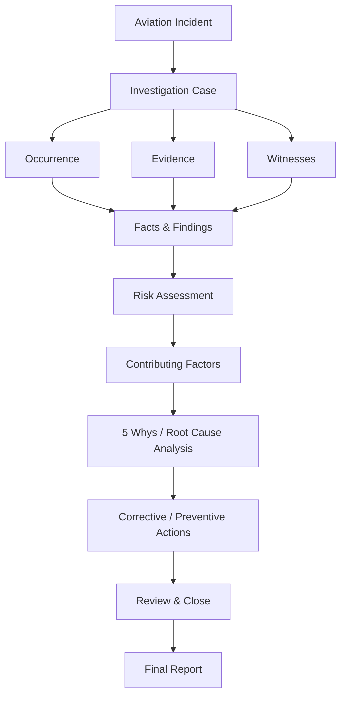
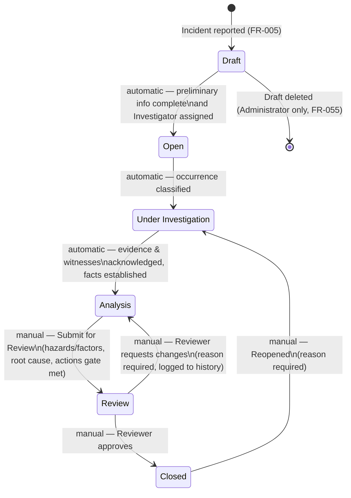
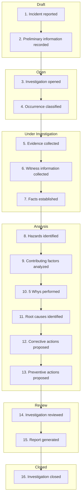

# Investigation Workflow — Aviation Incident Investigation Assistant

This revision replaces the previous 5-state workflow (`Draft/Open/Under Review/Changes
Requested/Closed`) with the 6-state model and 16-step sequence specified for this pass. See §12 for
what this changes relative to other spec files and what follow-up is still needed.

## Pipeline Overview

A simplified, conceptual view of the investigation pipeline — useful as a first mental model before
the precise mechanics in §2 (16-Step Sequence) and §5 (Sequence-to-Stage Diagram). This diagram
groups activity by *kind* (fact-gathering, risk assessment, causal analysis, corrective action,
closure) rather than by exact implementation order; where the two differ, §2/§5 are authoritative.
One notable difference worth flagging so this overview doesn't mislead: this application computes
Risk Assessment (FR-066/FR-067) as part of Occurrence Classification — step 4, in the **Open**
stage — deliberately *before* Evidence/Witness collection, so an investigation gets an early triage
signal as soon as it's classified, rather than waiting until fact-finding is complete.

## 1. Design Principles

- **Section editing stays non-linear; the *stage* is a computed progress marker, not a lock.** Any
  data section reachable from the stepper (`ui-spec.md` §2) can be opened and edited regardless of
  current stage, right up until the investigation enters **Review** or **Closed** (at which point it
  is read-only, per §7). A user may work ahead — e.g., drafting a hazard while still in **Open** — the
  stage simply reflects the furthest point the recorded data currently supports.
- **Two kinds of transition.** The first three forward transitions (Draft→Open, Open→Under
  Investigation, Under Investigation→Analysis) are **automatic**: the system advances the stage the
  moment its information gate (§8) is satisfied, with a visible "Stage advanced" notice — no button
  click required. The last two transitions (submit for review, review decision) are **manual
  ceremony actions**: they involve a person other than the investigator (a Reviewer) and carry real
  consequences (locking the record, formal sign-off), so they always require an explicit action and,
  for a rejection or reopen, a reason.
- **Stage never auto-regresses.** If a user edits previously-complete data in a way that would no
  longer satisfy an already-passed gate, the stage does not automatically revert. The next manual
  ceremony transition (submitting for review) always re-validates the full gate from scratch, so any
  regression is caught before the record is locked — it just doesn't retroactively undo progress
  silently.

## 2. The 16-Step Investigation Sequence

| Step | Name | Occurs in stage | Primary FR references |
|---|---|---|---|
| 1 | Incident reported | Draft | FR-005 |
| 2 | Preliminary information recorded | Draft | FR-012 |
| 3 | Investigation opened | Draft → Open | FR-006 |
| 4 | Occurrence classified | Open | FR-027, FR-028, FR-066, FR-067 |
| 5 | Evidence collected | Under Investigation | FR-021 – FR-024 |
| 6 | Witness information collected | Under Investigation | FR-019 – FR-020 |
| 7 | Facts established | Under Investigation | FR-013 – FR-016, FR-025 |
| 8 | Hazards identified | Analysis | FR-029 – FR-030 |
| 9 | Contributing factors analyzed | Analysis | FR-031 – FR-033 |
| 10 | 5 Whys performed | Analysis | FR-034 – FR-037 |
| 11 | Root causes identified | Analysis | FR-038 – FR-039 |
| 12 | Corrective actions proposed | Analysis | FR-040 – FR-041 |
| 13 | Preventive actions proposed | Analysis | FR-042 – FR-043 |
| 14 | Investigation reviewed | Review | FR-049 – FR-052 |
| 15 | Report generated | Review / Closed | FR-056 – FR-058 |
| 16 | Investigation closed | Closed | FR-053 |

## 3. States

| State | Meaning | Data editing | Who can advance out of it |
|---|---|---|---|
| **Draft** | Occurrence logged; only the initial report and preliminary occurrence details exist. Not yet a formally-owned investigation. | ADMIN, MANAGER, INVESTIGATOR | ADMIN, MANAGER, INVESTIGATOR (automatic on gate) |
| **Open** | Formally opened and assigned to an Investigator; classification in progress. | ADMIN, MANAGER, INVESTIGATOR (assigned) | Same (automatic on gate) |
| **Under Investigation** | Fact-finding under way: evidence, witnesses, aircraft/flight/location/persons detail. | ADMIN, MANAGER, INVESTIGATOR (assigned) | Same (automatic on gate) |
| **Analysis** | Causal analysis under way: hazards, contributing factors, 5 Whys, root causes, proposed actions. | ADMIN, MANAGER, INVESTIGATOR (assigned) | ADMIN, MANAGER, INVESTIGATOR (assigned) — manual "Submit for Review" |
| **Review** | Submitted; awaiting an independent Reviewer's decision. Locked to everyone except the Reviewer's decision controls. | Nobody (locked); REVIEWER may add comments | REVIEWER (ADMIN emergency override) — manual decision |
| **Closed** | Finalized. Report is final, not draft-watermarked. | Nobody (locked) | ADMIN, MANAGER, INVESTIGATOR — manual "Reopen" |

## 4. State Diagram

## 5. Sequence-to-Stage Diagram

## 6. Valid State Transitions

| From | To | Trigger | Actor | Kind |
|---|---|---|---|---|
| *(none)* | Draft | Investigation created | ADMIN, MANAGER, INVESTIGATOR | Manual |
| Draft | Open | Preliminary info complete + Investigator assigned | System | Automatic |
| Draft | *(deleted)* | Draft investigation deleted | ADMIN | Manual |
| Open | Under Investigation | Occurrence classified | System | Automatic |
| Under Investigation | Analysis | Facts established, evidence/witnesses acknowledged | System | Automatic |
| Analysis | Review | Submit for Review (gate met) | ADMIN, MANAGER, INVESTIGATOR (assigned) | Manual |
| Review | Closed | Reviewer approves | REVIEWER (ADMIN override) | Manual |
| Review | Analysis | Reviewer requests changes | REVIEWER (ADMIN override) | Manual |
| Closed | Under Investigation | Investigation reopened | ADMIN, MANAGER, INVESTIGATOR | Manual |

No other `(From, To)` pair in this table is valid. See §7.

## 7. Preventing Invalid Transitions

### 7.1 Rules

- **No forward skipping.** A transition may only move to the single next stage in sequence (Draft→
  Open→Under Investigation→Analysis→Review→Closed). Draft cannot jump directly to Analysis, Review,
  or Closed; Open cannot jump to Review or Closed; etc.
- **No arbitrary backward movement.** The only backward transitions that exist at all are Review→
  Analysis (reviewer rejection) and Closed→Under Investigation (reopen). There is no "go back to
  Draft" or "go back to Open" from any later stage — see §1's non-linear-editing principle for why
  this is not a limitation in practice: data in any earlier section can still be corrected without
  needing the *stage* to move backward.
- **Server-side authority.** All of the above is enforced in the backend regardless of what the
  client UI shows or allows (ties to NFR-4.7); the automatic transitions in §6 are computed
  server-side from stored data, not set directly by client requests, so they cannot be spoofed.
- **Role enforcement.** A transition attempted by a role not listed as its Actor in §6 is rejected
  with HTTP 403 (e.g., an INVESTIGATOR calling the "approve" endpoint, or a REVIEWER calling "submit
  for review").
- **Terminal states have no forward exit except through their defined transition.** Closed has
  exactly one way out (Reopen); there is no "Closed → Draft" or "Closed → Analysis" shortcut, so a
  reopened investigation is always required to pass through Under Investigation → Analysis → Review
  again before it can close a second time.

### 7.2 Transition Validity Matrix

✓ = valid per §6, — = invalid, blocked server-side.

| From ↓ / To → | Draft | Open | Under Inv. | Analysis | Review | Closed |
|---|---|---|---|---|---|---|
| **Draft** | — | ✓ | — | — | — | — |
| **Open** | — | — | ✓ | — | — | — |
| **Under Investigation** | — | — | — | ✓ | — | — |
| **Analysis** | — | — | — | — | ✓ | — |
| **Review** | — | — | — | ✓ | — | ✓ |
| **Closed** | — | — | ✓ | — | — | — |

## 8. Information Required to Advance Each Stage

| Transition | Required before advancing |
|---|---|
| **Draft → Open** | Title, Occurrence Date, Reporter (creation fields, FR-005) recorded; Occurrence Details complete — Occurrence Date/Time, Phase of Flight, Brief Description, Narrative Description (FR-012); an Investigator assigned (FR-006). |
| **Open → Under Investigation** | Occurrence Classification complete — Category and Subcategory set (manually or via an accepted Suggested Classification, FR-027/FR-028), **and** Actual Outcome, Potential Outcome, and Likelihood of Recurrence recorded so that Severity, Risk Level, and Investigation Priority can be computed (FR-066/FR-067, `data-model.md` §6.5–§6.6). |
| **Under Investigation → Analysis** | Aircraft minimum fields (registration, model, damage level); Flight Information minimum fields (flight rules, departure, destination, PIC name, crew complement); Location minimum fields (location description, lighting conditions); Persons Involved acknowledged (at least one entry, or the explicit "no persons involved" toggle); Evidence acknowledged (at least one item, or an explicit "no evidence currently available" acknowledgment — see §9.2); Witnesses acknowledged (at least one entry, or an explicit "no witnesses" acknowledgment). |
| **Analysis → Review** | At least one Hazard **or** at least one Contributing Factor; at least one Potential Root Cause — each with Category, Supporting Evidence, and Confidence Level recorded — **or** an explicit, justified "root cause could not be conclusively identified" override (see §9.5); at least one Action (Corrective or Preventive) with an owner and due date. A 5 Whys analysis is recommended but never required to reach a Potential Root Cause (soft guidance only; an investigator may record one directly). |
| **Review → Closed** | Reviewer decision recorded as **Approved** (FR-051). The submission-time gate (Analysis → Review row above) is re-checked at approval time as a defense-in-depth measure. **Additionally**, every action with `requiredForClosure = TRUE` must be `Completed`, `Verified`, or `Cancelled` — a hard block, not a warning (see §9.6); non-required actions only require Reviewer acknowledgment. |
| **Closed → Under Investigation (Reopen)** | A reopen reason (minimum 10 characters, FR-054). No other gate — reopening is always permitted on a Closed investigation regardless of its prior content, since the point of reopening is precisely to add or correct something. |

## 9. Edge Cases

### 9.1 Investigation saved before completion
Because sections use explicit Save (`ui-spec.md` UI-1), partial data is the normal, expected state
for most of an investigation's life. Saving an incomplete section never triggers an unwanted stage
transition — a stage only advances when its specific gate (§8) is fully met, never on a generic
"save" action. A user can close their browser mid-section and resume later with no data loss beyond
the current unsaved field.

### 9.2 Missing evidence
Not every occurrence yields recoverable physical evidence. The Evidence section supports an explicit
**"No evidence currently available"** acknowledgment, distinct from an untouched section — this lets
the Under Investigation → Analysis gate be satisfied honestly rather than forcing a fabricated
evidence entry. If evidence is later recovered (even after the investigation has advanced), it can
still be added retroactively via the normal non-linear editing (§1); the acknowledgment flag is
cleared automatically the moment a real evidence item is added.

### 9.3 Unknown witness
A witness's identity is sometimes never established (an anonymous caller, an unidentified bystander).
The Witness record's Name field accepts a literal value such as "Unknown / Unidentified" rather than
requiring a real name — the system does not force fabrication of identity data. Contact Info is
optional in this case, and Reliability Assessment is typically set to Low with a note explaining why.

### 9.4 Multiple contributing factors
Fully expected and fully supported: a Contributing Factor list has no upper bound, and a single
factor may link to multiple Hazards (many-to-many, `data-model.md` §2.15). The Analysis → Review gate
only requires *at least one*; real investigations commonly have several, and the report
(`report-spec.md` §3.13) lists all of them grouped by category.

### 9.5 No root cause identified
Occasionally a genuinely conclusive root cause cannot be pinned down with available evidence. Rather
than blocking the investigation indefinitely, the Root Cause Analysis section offers an explicit
**"Root cause could not be conclusively identified"** override, which requires a mandatory
justification text (minimum 20 characters explaining why). Using the override satisfies the
Analysis → Review gate in place of an actual Potential Root Cause entry — note that even a
*non*-inconclusive Potential Root Cause is never presented as a settled fact either
(product-spec §11.6); "inconclusive" and "confident assessment" are both points on the same spectrum
of investigator-stated certainty, not a binary between "unproven" and "proven." The generated report
surfaces the inconclusive case prominently — as an explicit statement, not a silently empty section —
so a reader never mistakes "inconclusive" for "not yet reviewed."

### 9.6 Corrective action overdue, and closing with incomplete actions
Whether an incomplete action blocks closure now depends on its `requiredForClosure` flag
(`data-model.md` §3.19–§3.20, §6.9.3):

- **Required actions** (`requiredForClosure = TRUE` — the default for Corrective actions) **hard
  block** the Review → Closed transition until each reaches `Completed`, `Verified`, or `Cancelled`.
  The Reviewer sees exactly which required actions are blocking, each linking directly to it, and
  Approve is disabled until they are resolved — not merely warned about, per the same
  "disabled, not merely warned" standard already used for the Analysis → Review submission gate (§7.1).
- **Non-required actions** (`requiredForClosure = FALSE` — the default for Preventive actions,
  reflecting that these often extend past an investigation's own timeline) do **not** block closure
  even if incomplete or Overdue. The Reviewer instead sees a non-blocking acknowledgment step listing
  them, which must be actively confirmed before Approve is enabled — so closing with unresolved
  non-required actions is still a visible, deliberate decision, just not a hard stop.
- **Emergency override**: ADMIN may close despite blocked required actions via an explicit override
  requiring a mandatory justification (minimum 20 characters), logged to `InvestigationHistory`
  (`data-model.md` §6.9.3) — never a silent bypass.
- An action's Overdue status (FR-046) is purely a derived display state; it has no bearing on this
  rule beyond whatever `requiredForClosure` and `status` it already carries. Actions of every kind
  remain tracked and visible (dashboard, Action Tracker, report) after the investigation is Closed.

### 9.7 Investigation reopened
Reopening (Closed → Under Investigation) requires a reason and does not clear any previously
recorded data — everything from the prior cycle remains intact and visible. The investigation must
pass through Under Investigation → Analysis → Review again to close a second time; it cannot jump
directly back to Review or Closed. Every reopen event is permanently logged (module 25,
`audit/history`) and shown interleaved with the review history in the final report, so a reader can
see the full back-and-forth across multiple cycles if it happens more than once.

### 9.8 User attempts to close an incomplete investigation
"Close" is never a directly-invokable action from Draft, Open, Under Investigation, or Analysis — the
control simply does not exist outside the Review stage's Reviewer-decision step, both in the UI and
at the API level (§7.1's "no forward skipping" rule). An attempt to call the close/approve operation
from any other stage, or by any role other than REVIEWER (or ADMIN's override), is rejected with a
clear "This investigation is not awaiting review" or "You do not have permission to approve this
investigation" error, and no state change occurs.

## 10. Role Interaction Summary

| Action | ADMIN | MANAGER | INVESTIGATOR | REVIEWER | VIEWER |
|---|---|---|---|---|---|
| Create investigation (Draft) | ✓ | ✓ | ✓ | – | – |
| Edit sections (Draft/Open/Under Investigation/Analysis) | ✓ | ✓ | ✓ (assigned) | – | – |
| Assign/reassign Investigator | ✓ | ✓ | – | – | – |
| Submit for Review (Analysis → Review) | ✓ | ✓ | ✓ (assigned) | – | – |
| Approve / Request Changes | ✓* | – | – | ✓ | – |
| Reopen (Closed → Under Investigation) | ✓ | ✓ | ✓ | – | – |
| Delete Draft investigation | ✓ | – | – | – | – |
| View investigation / report | ✓ | ✓ | ✓ (own/assigned) | ✓ (all) | ✓ (non-draft only) |

\* ADMIN retains an emergency override for support/demo purposes; the primary actor for review
decisions is REVIEWER, preserving independence from the investigating team (product-spec §8.1).

## 11. Investigation Support Touchpoints (rule-based, no external API)

Per product-spec §11.1, every touchpoint below must present its output using the exact labeled term
shown, never as an authoritative conclusion:

- **Occurrence classified (step 4)**: "Suggest Classification" produces a **Suggested
  Classification**, requiring explicit acceptance before it is saved (FR-028).
- **Hazards identified (step 8)**: Initial and Residual risk scores/bands auto-compute live from the
  numeric Likelihood × Severity formula against the currently-configured risk bands as the user
  selects values (FR-029, FR-068, `data-model.md` §6) — a calculation, not a suggestion, so it is not
  subject to the confirm-before-persist rule, but is always shown with its inputs visible for
  transparency. This is a configurable educational risk model, not an official regulatory risk
  matrix (product-spec §11.5).
- **Contributing factors analyzed (step 9)**: "Find Potential Contributing Factors" surfaces
  **Potential Contributing Factor** candidates drawn from similar closed investigations, each
  requiring an explicit "Add to this investigation" action before being saved (FR-033).
- **5 Whys performed (step 10)**: "Suggest Next Question" produces a **Recommended Follow-up**
  question pre-filled into the next Why entry (up to Why #5, then capped — FR-035), fully editable
  before save (FR-036). Concluding the chain (at Why #1 through Why #5) into a Potential Root Cause
  is always available and does not require reaching the cap (FR-038).

## 12. Consistency Notes for Other Spec Files

This revision changes the state model from the 5 states used elsewhere (`Draft/Open/Under
Review/Changes Requested/Closed`) to the 6 states specified here. The mapping is:

| Old state | New state(s) |
|---|---|
| Draft | Draft |
| Open | Open, Under Investigation, Analysis (now three distinct stages) |
| Under Review | Review |
| Changes Requested | *(removed as a stored state — a rejection is now the Review → Analysis transition, with the reason captured in the review history log instead of a standing status value)* |
| Closed | Closed |

**Update**: `data-model.md` and `ui-spec.md` have since been revised in later passes and now align
with this 6-state model. Still outstanding: `functional-requirements.md` (status recap in §0.3 and
every FR referencing `OPEN`/`UNDER_REVIEW`/`CHANGES_REQUESTED`, notably FR-011, FR-049–FR-054).
